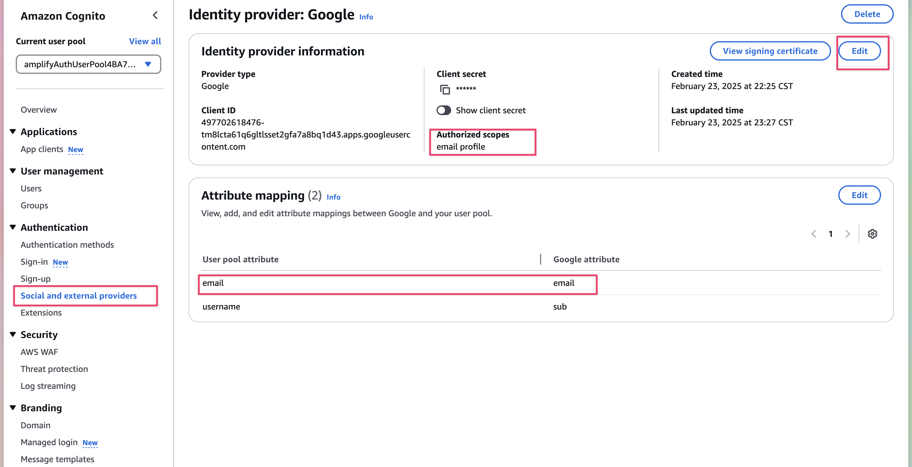

# Local Hosting
## Setup AWS Amplify Locally
Download `amplify_outputs.json` from and insert it into the root directory of rustle-rustle-react. 
The file can be located in the `Deployed Backend Resources` tab shown in the images below.


*Figure 1. Amplify home page*

*Figure 2. Amplify deployed backend resources*


Once the `amplify_outputs.json` is put in place, download the [AWS CLI](https://docs.aws.amazon.com/cli/latest/userguide/getting-started-install.html) depending on your local machine.


#### Windows
Install from [this link](https://awscli.amazonaws.com/AWSCLIV2.msi) and follow installer instructions

#### MacOS
Install from [this link](https://awscli.amazonaws.com/AWSCLIV2.pkg) and follow installer instructions

#### Linux
```bash
curl "https://awscli.amazonaws.com/awscli-exe-linux-x86_64.zip" -o "awscliv2.zip"
unzip awscliv2.zip
./aws/install -i /usr/local/aws-cli -b /usr/local/bin
```

After AWS CLI is installed, enter the following commands in terminal
```bash
aws configure sso
```

Then, insert this information when asked
```bash
SSO session name (Recommended): amplify-admin
SSO start URL: https://d-9067c77c96.awsapps.com/start
SSO region: us-east-1
SSO registration scopes [sso:account:access]: <leave blank>
```

After this, it should open up a new browser window and use the username and password. 
Input your username and password. Then, go back to the terminal and input
```bash
CLI default client Region [us-east-1]: us-east-1
CLI default output format [None]: <leave blank>
CLI profile name [amplify-policy-<your-aws-account-id>]: default
```

After everything is setup properly, setup your AWS sandbox with the following command
```bash
npm i
npx ampx sandbox --profile default
```

If done correctly should take 3-4 minutes to run and you should see the following when done.
```bash
[Sandbox] Watching for file changes...
File written: amplify_outputs.json
```

Then just run the front end application like normal with `npm run dev`.

Remember to run the sandbox start up command (`npx ampx sandbox --profile default`) when testing locally.

## AWS S3 Bucket Permission Settings
For loading files from Amplify Storage with S3 buckets locally, some permissions will have to be changed for 
the files to load on localhost. Navigate to AWS S3 buckets and search for your sandboxed s3 bucket.
Select the drive that contains `raccoonteamdrivebucket` as shown below.


*Figure 3. S3 Bucket search*


Once you are in the correct bucket, click permissions and then turn off `Block all public access` from `Block public access (bucket settings)`.


*Figure 4. S3 Bucket permissions view*


*Figure 5. Bucket turn off block all public access*

Lastly, paste the following code within the first `Statement` section:
```
"Sid": "AllowPublicRead",
"Effect": "Allow",
```

Your Bucket Policy should look like the following iamge


*Figure 6. Bucket Access Permissions*

Then below the Bucket Policy, there is a Cross-origin resource sharing (CORS) that we have to edit and add `"x-amz-meta-name"` to.
This will allow our application to receive the name of the pdfs


*Figure 7. Bucket CORS changes*

## Google OAuth Setup
Follow the [official Amplify external identity provider guide](https://docs.amplify.aws/react/build-a-backend/auth/concepts/external-identity-providers/) steps for Google Sign-In to set up the authenticator and connect it to amplify. Also follow the redirect URLS instructions bellow the account creation instructions.


*Figure 8. Selecting correct instructions for Auth*

Once Google OAuth's `Client ID` and `Client Secret` is set up, run the following commands locally:

```bash
npx ampx sandbox secret set GOOGLE_CLIENT_ID
<enter GOOGLE_CLIENT_ID>
npx ampx sandbox secret set GOOGLE_CLIENT_SECRET
<enter GOOGLE_CLIENT_SECRET>
```

When you try to login on frontend, you will get an error saying `Access is Blocked: This app is unauthorized`
1. Click on error details
2. View Request details: `redirect_uri=` line 
3. Authorize the URI in the oauth client

May also need to go to amazon cognito and set email as an allows scope. 
1. Go to AWS Cognito
2. Find the instance for your local machine (you can check the auth url and match it with yours)
3. Go to `social and external providers`
4. Make sure `authorized scopes` include `email profile`
5. Make sure Attribute Mapping has:
    - `given_name` -> `given_name`
    - `username` -> `sub`


*Figure 9. AWS cognito settings to update*

### Troubleshooting
If you come across errors where the login screen wouldn't even pop up and there are errors saying callback URL failed, then make sure to check your `amplify/auth/resources.ts` and make sure that the `callBackUrls` and `logOutUrls` contains the urls you are testing on.


*Figure 10. AWS amplify authentication resources settings*
