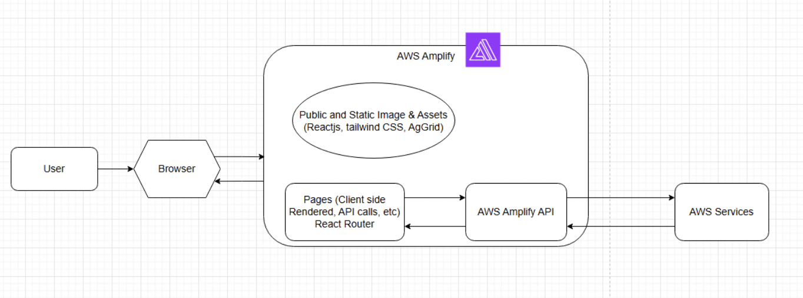
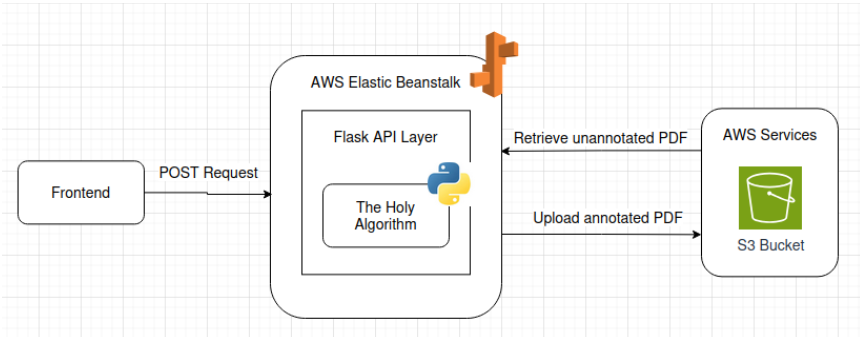
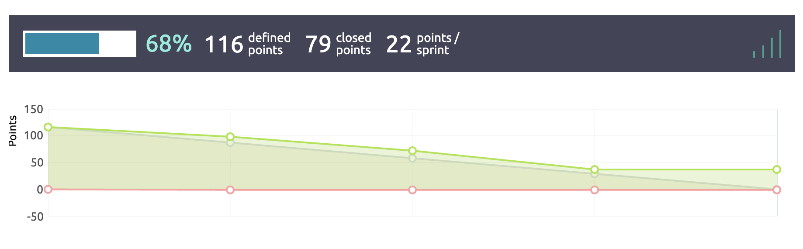

# Capstone Report - HardHatRacoons

Devs: Chris Kelley, Michael McCarthy, Emmie Teng, Stella Yang, Lucy Zhang

## Abstract
Manual analysis of construction blueprints is a critical but time-consuming task in the building industry, often requiring hours of human effort to identify structural components and estimate material costs. This capstone project, sponsored by Vector Intelligence, introduces an end-to-end system that automates the interpretation of vector-format construction blueprints with a focus on identifying steel beams and columns. The system combines a backend algorithm for structural recognition with a responsive and accessible web interface that supports file uploads, annotation visualization, and data summarization. Annotated outputs include labeled PDFs and CSVs containing structural specifications such as dimensions and material weights, which can be used to generate accurate cost projections.

The backend is built with Python and AWS Lambda for scalable processing, while the frontend leverages ReactJS, TailwindCSS, and AWS Amplify to ensure a seamless and mobile-friendly user experience. Emphasis was placed on accessibility through features such as text scaling, dyslexia-friendly fonts, color contrast modes, and screen reader compatibility. To evaluate the platform, we conducted usability testing with 20 participants from a range of technical backgrounds. Results from these studies showed high ease-of-use ratings across all core features, with particular strengths in file navigation, annotation clarity, and upload functionality. Qualitative feedback also revealed several desired features—such as better file sorting, more visible loading indicators, and persistent navigation states—which have since been incorporated into the product roadmap.

This project demonstrates that automating blueprint analysis can significantly reduce the time and cognitive load required to prepare construction bids. By integrating machine-readable interpretation with a user-centered design approach, the system provides an efficient, scalable, and inclusive solution for stakeholders across the construction pipeline.

## 1 Introduction

The construction industry accounted for over 8 million jobs in 2024, making it one of the largest employment sectors in the U.S. economy (U.S. Bureau of Labor Statistics, 2025). Vector Intelligence has partnered with stakeholders in the steel industry to develop software that enables end users to estimate projected material costs directly from vectorized construction blueprints. This advancement allows users to gain essential specifications and insights about a project within minutes—compared to the days it would typically take to analyze blueprints manually. Currently, only the steel beam annotation and CSV generation is automated. A team still needs to manually download the blueprint, draw bounding boxes around relevant structures, generate the CSV and annotations, then upload the new/updated files back for clients to view. Our goal is to make an algorithm that identifies relevant steel structures, and fully automate the above described process.

### 1.1 Case Scenarios

#### Construction Supply

John owns a construction supply company that provides steel beams, concrete, and other materials. He frequently receives bulk orders from contractors and engineers but struggles to predict material demand accurately. 
One day, a contractor using the Blueprint Analysis System reaches out with an automated material list generated from a newly analyzed blueprint. The system provides detailed insights, including:

- Exact quantities of beams, columns, and concrete needed
- Projected delivery timeline based on project phases
- Material specifications ensuring compatibility with the project

Using this data, John updates his inventory and places early supplier orders to meet demand. Additionally, the system suggests other upcoming projects in the area with similar material needs, helping him forecast future sales.
By leveraging real-time blueprint analysis, John minimizes stock shortages, reduces excess inventory costs, and ensures timely deliveries, leading to stronger relationships with contractors.

#### Construction Team

Sarah is reviewing a new architectural blueprint for a high-rise building. Traditionally, she would manually label beams, columns, and estimate material quantities—a tedious and error-prone task.
She uploads the blueprint into the Blueprint Analysis System, which:

- Automatically detects and labels all beams and columns
- Calculates material requirements, including steel reinforcement and concrete volumes
- Highlights potential errors, such as missing load-bearing columns

The system generates a PDF report with annotations and a bill of materials, allowing Sarah to quickly validate the data and share it with the construction team.

By automating blueprint analysis, Sarah saves hours of manual work, reduces the risk of structural miscalculations, and ensures a smoother transition from design to construction.

### 1.2 Goals and Constraints

The team will create a UI/UX web app that asks for user input of a construction blueprint pdf file in vector format and returns a file or view with all the steel beams and columns highlighted, marked, and labelled to scale. The team is expected to read through existing code and refine it, as well as add features like labelling concurrent columns and discerning overlapping sections. The UI/UX will also display information about the beams separately and may display a few analytics as a reach goal. The web app should be accessible, aesthetic, and easy to use. The team may leverage machine learning to achieve these goals.

The team is not expected to create a 3D model of the construction blueprint file at the given time. The team is also not expected to make any improvements to the Vector Intelligence portal website.

### 1.3 Solution Summary

The end goal of our project is to quickly and efficiently automate the task of determining which materials will be used in steel construction. The purpose of this is to allow the end users to get an estimate for how much a construction project will cost them. Our solution will work by automating the proccess of uploading a blueprint PDF and recieivng a coresponding annotated PDF and bill of materials. We will develop a web app that handles each step in the above mentioned process, requiring little to no manual intervention. We will also need to develop an algorithm to identify relevant steel structures in blueprint PDFs and output a JSON that can be used by our sponsor's algorithm.

## 1.4 Evaluation Summary

The system will be evaluated through a combination of quantitative and qualitative approaches:

**Quantitative:** The system will be evaluated based on the time it takes for users to get feedback on an uploaded PDF. The goal will be to successfully return an annotated PDF and the corresponding CSV to users in a matter of minutes as opposed to hours. Additionally, it should not take users more than a couple of minutes (say 3 minutes) to login to our application and upload a PDF.

**Qualitative**: We will utilize surveys and interviews for end users to gauge the accessibility and user friendliness of our front end designs. These will focus on areas such as ease of navigation, visual design, and the intuitiveness of interactive elements.

**Main findings**: After performing 20+ user studies and uploading various blueprint PDFs to our webapp, we found the processing time for PDFs to take less than 10 minutes on average and still below an hour for larger PDFs. Users took on average 107 seconds to perform all 9 tasks assigned to them, and 21 seconds to successfully upload a PDF. All users have never had prior interaction with the webapp. Most users complimented the aesthetics and navigability of the web app when prompted for extra feedback. Many users also did not have any specific things they would like to change about the website when asked so. Greater than 75% of users also rated the understandability of the metrics a 5/5. The team also achieved a google lighthouse score of greater than 90 out of 100 on all pages in both viewing modes (light/dark), making our website decently accessible for impaired users.

## 2 Related Work

The project can be split into two main components: the frontend and the backend. The main goal of the frontend is to provide a user-friendly platform for uploading, viewing, and receiving documents, namely, construction blueprints. The frontend also has the ability to interpret the annotated documents and data. The backend comprises of an algorithm for interpreting and notating different parts of a construction blueprint based on the presence of steel beams; the annotated pdf is then run through a separate program and data is extracted. Since the backend is the main topic of innovation, it will be the main focus of the related work section as well.  
The construction industry has lacked movement and growth in recent years. According to the article “Blueprinting construction logistics services for quality improvement” by Gremyr et al. (2022), an improvement in construction logistics services will improve the “efficiency and sustainability of construction projects” (p. 60). However, due to a lack of a concrete definition) of what processes need to be in place, it can be difficult to make noticeable improvements to construction logistics services. However, according to our partner company, Vector Intelligence, one way to start making a valuable improvement is to streamline the bidding process. This is where the project comes into play, as through providing construction firms with an interface to understand and annotate construction blueprints, the company can severely reduce the time spent preparing documents and materials for the blueprint and move straight on to bidding and planning.

The main algorithmic component of the backend is to parse the construction blueprint. Analyzing construction drawings and blueprints requires a lot of manual effort. In the article “Towards fully automated processing and analysis of construction diagrams: AI-powered symbol detection” (Jamieson et al, 2024), Jamieson et al. propose a way to automate the processing of construction drawings. The project would take it a step further by processing a computerized blueprint into a breakdown of materials needed for steel suppliers. Another way to recover information from blueprint floor plans that are stored as rasterized images is postulated in the article “Vectorizing Building Blueprints” (Song, 2022). The algorithm segments the image, fills in any gaps with machine learning (generative adversarial network to be specific), and simplifies the model. The article compares this approach to two other methods currently proposed and notes significant improvement. This algorithm could provide valuable insights into how the team should design the project’s algorithm. Learning-based algorithms such as the one proposed in the prior article have shown more prevalence in comparison to rule-based algorithms in recent years, as recent advancements in the field have made them more viable (Pizzaro, 2022). The project team’s algorithm seeks to recognize steel structures in construction blueprints and similarly label components of the blueprint. The approach described in the article may be considered as a prospective way to implement some of the structure and symbol recognition in the project team’s algorithm as it was highly successful. However, floor plan blueprints look dissimilar to construction blueprints in some aspects as they generally do not describe the underlying structure of the building in detail. In a separate article, “Using Architectural Blueprints for Intelligent Robot Cognitive Mapping as a Knowledge Based System”, the author writes that “The project’s aim is to give the ability to the intelligent robot read and gain knowledge from the architectural blueprints maps of indoor environments to build its own cognitive maps as a knowledge-based system” (Al-Ghazi, 2010, p. 4). The project seeks to do the same but in a format that humans can understand and interpret, rather than interpreted by an artificial intelligence. The project can reference the algorithms used in the article to interpret the indoor blueprints. Lastly, one specific method that holds relevance to our project is recognizing text in an image. One article “Methods of recognizing texts in different images” (Raximov, 2021) gives a detailed guide on how to do this, including methods of doing it in different languages if necessary. This will be useful when determining which pages of a building are relevant and should be added to the total cost of the building. Another related article “Deep Learning for Computer Vision: A Brief Review” (Voulodimos, 2018) talks about using computer vision to perform various tasks, including object detection, which might be useful to determine which blocks are text and even further, what each text block says. This can assist with designing our algorithm to recognize certain parts of the blueprint and identify related sections.

One of the most closely related topics to this project, specifically the backend, is image semantic segmentation, the idea of classifying each pixel in an image into a category. The team is similarly aiming to classify each line segment into a cluster. A few related works have described various semantic segmentation methods and different perspectives on how they used them. The first article “Rethinking Atrous Convolution for Semantic Image Segmentation” (Chen, 2017) describes using a method called atrous convolution, a method of increasing the field of view without losing details, which will be useful for us when we try identifying smaller steel structures. Another article “RefineNet: Multi-Path Refinement Networks for High-Resolution Semantic Segmentation” describes a method of using multiple paths to use long range connections along with multiple paths to get the most accurate result for which category a pixel belongs to, which might be relevant when defining which line segments belong to which clusters. Another article, “Learning Object Interactions and Descriptions for Semantic Image Segmentation” (Wang, 2017), uses CNNs to learn how objects are labeled and then applies that to semantic segmentation by making a prediction for which category each pixel belongs to, which might be a useful method to cluster each group of line segments relatively quickly. The last semantic segmentation article, “A Deep Learning Approach to Semantic Segmentation for Architectural Blueprint Interpretation and Geographic-based Material Recommendation” (Chon, 2024), describes a method of using machine learning to identify what parts of a floor plan blueprint relate to each type of room and the alignment of the rooms. The algorithm proposed is a convolution neural network, which segments the given blueprint into component rooms, similar to the first step of the first discussed direct reference. The segmentation approach may help the project team break down a construction blueprint into recognizable steel structures, but other algorithms will be considered first as speed of processing is the main priority in the project.

One concern of our project is how to set up the connection between the frontend and backend such that it is not only cost effective but fast and reliable for users. One idea is the use of AWS lambda functions, which are a service offered by Amazon Web Services that automatically runs a function based on a customizable set of triggers. The team will explore using lambda functions to quickly process blueprint pdfs and return it back to the front-end. The article “On Data Processing through the Lenses of S3 Object Lambda” (Sarroca, 2023) describes the uses of lambda functions, along with the pros and cons of using this method over other existing methods. One of the issues mentioned is cost effectiveness, in which lambda functions seem to support our goal of keeping costs down but speed up. Using lambda functions will allow the team to forgo the need for a separate backend and backend deployment but keep the same functionality.

The largest stretch goal of the project is 3D modelling, as it was originally pitched to the team. The idea is that an algorithm can have some blueprint data inputted and output a 3D representation of the blueprint. This will be helpful in visualizing where each piece of steel will go in the building. The article “Building Information Modeling (BIM): Trends, Benefits, Risks, and Challenges for the AEC Industry” (Azhar, 2011) describes the importance of having a model when it comes to building and construction. Models offer quick insight that is easily understandable at a glance to laymen and industry professionals alike. The article also mentions the ease of converting from a 3D model into a cost analysis, which is one of the end goals of our project. The current technology used to understand constructions in 2D is 3D Point Cloud. 3D Point Cloud data is an accurate representation of a 3D space obtained by laser scans and images. In “Applications of 3D point cloud data in the construction industry: A fifteen-year review from 2004 to 2018” (Wang and Kim, 2019), Wang and Kim explore the use cases of 3D point cloud data such as 3D reconstruction and geometric quality inspection. Typically, a 3D model is scanned into point cloud data and then compressed into a blueprint; the stretch goal will essentially be reverse engineering this process and “uncompressing” the blueprint. Another reference, “3D Modelling by Means of Artificial Intelligence” (Bebeshko, 2021), describes their method of using AI and machine learning to create 3D models using 2D images. This could be an alternate approach to our initial approach, which is processing the blueprints and creating models based off extracted data. Machine learning on images could also help process parts of the pdf document that are hard to understand in vector format.

## 3 Requirements

The requirements for this project focus on building an accessible, user-friendly web application that parses vector-format construction blueprint PDFs to automatically identify, label, and annotate steel beams and columns. The system should generate a material specification report with dimensions, weights, and estimated costs, and support exporting the annotated PDF. The user interface must be intuitive and include accessibility features such as text scaling, high contrast modes, dyslexia-friendly fonts, screen reader compatibility, and light/dark mode toggling. It should also be mobile responsive, support multiple devices and viewports, and remain compatible with major browsers like Chrome, Firefox, and Edge. Additional features include toggleable annotation layers, zoom functionality, session-based blueprint viewing, and a dashboard summarizing extracted data. These requirements aim to enhance automation accuracy, streamline the user experience, and improve overall accessibility for a diverse user base.

### 3.1 User Stories and Usage Scenarios

1. As a _construction company_, I want to save the two hours it takes to manually parse a construction blueprint pdf to create a bid. Parsing the blueprint to find the sizes and amounts of steel needed for construction is a tedious and time-consuming process.
2. As a _client_, I want a crisp user interface to view the resulting data from scanning the construction pdf. The client UI should present the (modified) annotated PDF with clearly demarcated beams and columns. The project aims to automate this process, annotating the submitted PDF and producing an accurate report of the client’s steel needs.
3. As a _vision impaired user_, I want the UI to be accessible for me. The UI should have the ability to increase and decrease the size of text universally and have high contrast. Images should have alt text and the web app should ensure screen reader compatibility. This will allow me to adjust the UI to be more readable for me or play the page to get the information I need.
4. As a _dyslexic user_, I want to be able to view the information in a font that is more readable for me. The UI should provide basic font switching features. This ensures that I can read and understand the information being presented better.
5. As a _user without a home computer_, I want to still be able to use this software at home. The UI should be mobile friendly and implement dynamic resizing/relayouting based on view size so that it can fit on a variety of different devices. This will allow the software to be used from different devices and viewport sizes including tablets, phones, and splitscreen.
6. As a _user who prefers certain web browsers_, I would like to be able to run the web app on my preferred web browser of choice. The project should be compatible with the major web browsers such as chrome, firefox, and edge. This will allow users with different system requirements or preferences to use their preferred browser.
7. As a _hearing impaired user_, I would like the app to be accessible for me. All sounds and videos must have a text or visual equivalent representation. This includes shaking for notifications, subtitles, etc, as necessary. This will ensure that all the information needed is presented to all users in a way they can pick up on.
8. As _someone who has to work late nights_, I want the UI to not be too glaring. The UI should have the ability to switch between light and dark modes. This will allow me to switch to a more comfortable mode later in the day when visibility is lower.
9. As a _structural engineer_, I want to be able to see the annotated construction blueprint with all the data displayed but not visually cluttered so I can understand it. The UI should have multiple toggleable settings that show different information about the blueprint and allow the blueprint to be zoomable. This will allow clients who need specific information about the blueprint to toggle settings on and off as needed and zoom in to problem areas.
10. As a _construction estimator_, I want to be able to easily see summarizing information about the project to refine my bid creation experience. The UI should provide data analytics in a different tab that can assist with bid estimation. This will allow construction estimators to save time when creating bids for projects.
11. As a _steel supplier_, I want to know what types of steel are currently being used the most in my client’s construction projects. The project should provide collated metrics for steel suppliers based on client inputted blueprints. This will allow steel suppliers to stock types of steel that the clients might need soon and provide other ways to ensure they are not caught unaware.
12. As a _steel supplier_, I want a single place to view all the steel needs for a single bid, so that I do not have to go hunting/piecing together where to deliver/supply the steel.
13. As a _construction manager_, I want the user interface to be intuitive to use so that there does not need to be a lot of training for my employees.
14. As a _structural engineer_, I want the system to automatically extract and label beams and columns in a blueprint, so that I can quickly assess structural components without manual inspection.
15. As a _structural engineer_, I want the system to calculate the amount of materials needed based on the blueprint, so that I can make accurate material purchase decisions.
16. As a _structural engineer_, I want the system to annotate my PDF blueprints with labeled beams, columns, and material specifications, so that I can share them with my team efficiently.
17. As a _structural engineer_, I would like to scan the blueprints with my phone so that I can easily manage and view multiple blueprints in any session
18. As a _contractor_, I want the system to generate a detailed material list from the blueprint, so that I can accurately order supplies without wasting resources.
19. As a _project manager_, I want a dashboard that summarizes extracted data from blueprints, so that I can make informed decisions without manually reviewing each document.
20. As a _project manager_, I want the system to facilitate blueprint approvals with engineers and architects, so that I can streamline project workflows.

### 3.2 Definition of Success

Currently our sponsors have an algorithm that annotates relevant steel beams in a PDF and outputs a CSV, given a JSON containing the bounds of relevant steel structures. Currently, everything else is done manually from downloading submitted PDFs to drawing bounds around relevant structures to uploading the results to clients. Our task will be to develop an algorithm to automatically identify relevant steel structures and output a JSON of the bounds, as well as fully automate the pipeline from user upload to when they receive the resulting CSV and annotated PDF. By the end of this project, we aim to have a functional user interface that is simple to navigate and understand for the users. The user interface should have an intuitive way of representing specifications of all the different beams, either horizontal or vertical, within the scanned blueprints. The interface should also make sense to a user who is not familiar with construction. Analysis for success of the User interface will be evaluated through survey results of targeted end users. Lastly, the process of taking an uploaded PDF and generating the annotations and CSV for users should take minutes to complete with no external intervention.

## 4 Engineering Standards, Regulations, and Considerations

### 4.1 Engineering Standards

To ensure the reliability, compatibility, and maintainability of our blueprint analysis platform, we follow several key engineering standards. For processing and interpreting blueprints, we are mindful of industry standards such as **ASME Y14.41** and **ISO 16792**, which govern the proper representation of digital engineering drawings and ensure our annotation and parsing logic can adapt to common formats. Though our system currently processes PDFs, many of these originate from CAD tools or follow technical documentation conventions, making these standards important references. There is not a guarantee that the files we work with will adhere to any particular format, but looking to the most common and popular standards has provided a good start.

On the software engineering side, we adhere to **RESTful API principles** for backend communication, including standardized HTTP methods, status codes, and resource naming. Coding practices follow widely accepted conventions such as **PEP8** for Python and use **Prettier** to enforce consistent code formatting across our React (JSX) codebase in frontend development, which promote code readability, maintainability, and team collaboration. All code is managed using **git**, following a branching strategy that supports agile development.

For file storage and cloud infrastructure, we use **AWS services** (S3, Elastic Beanstalk, Amplify), and are informed by **ISO/IEC 27001** principles to maintain best practices in securing user data and managing access control. Finally, our user interface follows **WCAG 2.1 accessibility guidelines** to support a broad range of users, ensuring the application is intuitive, accessible, and responsive across devices.

### 4.2 Applicable Regulations

Our platform only handles files that are explicitly uploaded by the user. All processing is done within the scope of what the user expects — primarily the extraction of structural and material-related metadata from blueprint PDFs. To maintain transparency, we will clearly inform users that their uploaded PDFs will be processed by automated algorithms designed to identify and annotate steel-related content. The content of these files remains confidential and is not shared outside of their intended analysis pipeline.

During user studies, no personal information will be collected or required. Participants will be given temporary accounts and pre-selected PDF files to interact with, meaning they will not have to provide their own data or credentials. As such, there is minimal risk involved, and we will comply with standard research ethics guidelines such as those outlined by **Institutional Review Boards (IRBs)** in academic settings. For example, we will follow the **Belmont Report principles** — ensuring respect for persons, beneficence, and justice — by obtaining informed consent, providing clear instructions, and safeguarding participants’ anonymity.

### 4.3 Environmental and Health/Safety Concerns

While our project operates entirely in a digital space, we remain conscious of its environmental footprint. Our annotation and clustering algorithms — particularly those responsible for identifying steel-related pages and regions — have been optimized for both performance and energy efficiency. By reducing the number of unnecessary pages and irrelevant clusters processed, we conserve cloud computing resources and reduce energy consumption, which contributes to a more sustainable software solution.

Regarding health and safety, our platform is designed to be user-friendly and intuitive. The interface is ergonomically structured to minimize cognitive load and visual fatigue, allowing users to quickly upload, browse, and analyze their blueprints without navigating through complex or unnecessary interactions. The clear layout and minimal design help support a comfortable user experience and prevent repetitive stress from prolonged usage.

### 4.4 Ethical, Social, and Political Concerns

From an ethical standpoint, transparency in data handling is a central priority. Users will be informed of how their data is processed, and all uploaded files will be stored securely in cloud storage with appropriate access controls. We do not collect any personal data beyond what is strictly necessary for interacting with the system, and users can trust that their files are treated respectfully and confidentially.

Socially and politically, the project presents no controversial risks or concerns. Our system processes blueprints without regard to origin, content style, or file formatting — there is no discrimination or exclusion in how input data is handled. While the software is currently proprietary and limited to specific clients of a steel provider, it has the potential to benefit a wider community. If open-sourced in the future, it could support a broader range of construction and manufacturing teams by automating tedious manual annotation tasks, thereby increasing efficiency and accessibility. Our platform aims to be both technically robust and socially responsible.

## 5 Design Exploration

### 5.1 Comparison of Potential Solutions

Since our main goal is to reduce the amount of time spent during construction on determining the total cost of the whole construction project, there are a few different ways to do this. Method 1 is to take blueprint pdfs, run them through an algorithm that determines the weight and cost of each piece, and total up the cost. Method 2 is to use a formula to roughly estimate the total cost based on the volume and surface area of each floor. Method 3 is to look at historical data and find buildings of the same size and shape and estimate the value based on that data. All 3 of these methods will give us estimates that might be close to the exact value, but one method makes the most sense. Since one of our end goals is to reach a minimum success rate of 90%, we want to be very precise in calculating this total cost. Method 2 and 3 have the problem of being rough estimates, meaning they aren’t precise enough. Method 1 is more difficult, but if done correctly, it should lead to accurate results. Without looking specifically at the blueprint and calculating the cost of each piece, we won’t achieve results with the desired level of accuracy. Because of this, we will be choosing method 1 going forward.

**Algorithm First Rendition:** For the algorithm, we initially used SciPy’s built in DBScan model and wrote a custom function so DBScan would work with line segments as opposed to points. The page detection was also very barebones, running the algorithm on any page with the word “steel”. By using a custom distance metric for SciPy’s DBScan, we were limited to an O(n²) time complexity, performed over more pages than needed, resulting simple PDFs taking hours to proccess.

**Algorithm Second Rendition:** We later learned that AWS Lambda functions (which we initially planned to run our algorithm on) had a 15 minute limit. Thus we optimized our page search by looking instead for steelbeam keywords such as “W27x178” or “S24x121”. We also used the R-tree data structure to store line segments. These changes resulted in a O(n log n) time complexity over less pages. When paired with processing pages in parallel, runtime was dramatically reduced to mere minutes for most pdfs. However, to enable R-tree’s O(log n) search with SciPy’s DBScan, we used precomputed distance matrix’s, using up O(n²) space complexity, thus slowing down our machines or crashing it entirely with larger pdfs.

**Algorithm Third Rendition:** Due to various factors we decide to not use AWS Lambda, so the 15 minute hard limit was no longer an issue. But the space complexity issue needed to be fixed. SciPy’s DBScan does not support custom traversal, so we opted for writing our own DBScan algorithm using R-trees internally. This fixed our space complexity issue to O(n) and removed the need for parallel page processing. Paired with a couple of small optimizations to our page search, most PDFs could be processed in mere seconds.

### 5.2 Lo-fi Prototyping

_Figure 5.2.1 Initial System Diagram_

_Figure 5.2.2 Client UI Lo-fi Mockup - Idea 1_

_Figure 5.2.3 Client UI Lo-fi Mockup - Idea 2_

_Figure 5.2.4 Client UI Lo-fi Mockup - Draft_

The above Lo-Fi mockup in Figure 5.2.4 has multiple ideas in a rough sketch. Each part could be an individual feature. Figure 5.2.2 and 5.2.3 are more flushed out Lo-Fi designs that can be combined in the future.

### 5.3 Pilot Studies

Feedback received from our pilot studies concludes that our Lofi-Designs is definitely an improvement to the current existing interface, and there are also many suggestions for further improving our designs. Some of the notable comments were:

- Adding search bars / filters to screens for finding projects and building materials
- Clear icons and symbols to tell users where they are
- Hover over a project to summarize important information such as total cost
- Project folders of blueprints to organize gallery view
- Multi-pages/floors should be able to be navigated within the same file
- Reorganize upload button and loading to streamline the process

_Figure 5.3.1 Redesigned Lo-Fi of home-page and loading screen_

_Figure 5.3.2 Redesigned Lo-Fi of blueprint viewing and metrics pages_

### 5.4 Inclusion, Diversity, Equity, and Accessibility Considerations

This increases the accessibility of construction blueprints by allowing anyone to quickly read and understand the specifications of a building. It will also be helpful to the construction workers who are in charge of the actual construction by allowing them to visually see what their final work should look like. The software should be designed in a way where the outputs can be understood by not only professionals but also the common construction worker.

The UI/UX should meet a minimum accessibility requirement, accommodating those with various disabilities (such as motor or vision impairments) to use the product. The annotated PDF should be modified in a way such that it does not interfere with the existing accessibility options of the original document (PDF audio reader and existing text/images should not be impaired by the annotation).

## 6 System Design

### 6.1 Functional Design

_Figure 6.1.1 Level-0 Diagram showing major system components_

_Figure 6.1.2 Level-1 Diagram showing front-end components_

_Figure 6.1.3 Level-1 Diagram showing back-end components_

_Figure 6.1.4 State Diagram showing different states of the “Create Project” process_

#### Module Specifications:

- **ReactJS** - Using ReactJS as our frontend framework to build components and the UI used by our website.
- **Tailwind** - Tailwind is the primary CSS library used to style our HTML.
- **AgGrid** - Used to generate/prototype grid layouts used by the website
- **React Router** - Used to route multiple react pages.
- **NodeJS** - Used to import npm packages used by the project such as React Router and AWS Amplify
- **AWS Amplify** - Used to host the front end as well as communicate with the various AWS services.
- **PyMuPDF** - Python PDF reading library, used to extract line segments and text from PDF file.
- **Flask** - Python web framework used to serve API routes
- **boto3** - Python library used to communicate with AWS services (S3 Buckets)
- **AWS Elastic Beanstalk** - Used to host algorithm API and load balance according to request volume.
- **AWS S3** - Storage bucket used to store PDFs and CSVs.
- **GitHub** - Used to collaborate and set up GitHub Actions to push code to Amplify

#### API Specifications:

AWS API (Amplify), used to communicate with auth and S3, as well as host/deploy the website.

Algorithm API (in house), called by frontend to schedule pdf processing.
- GET / - Basic health check.
- POST /api/v1/pdf-proccessing/request - Initiates asynchronous processing of a PDF document uploaded to S3.

### 6.2 Data Design

Our data will be stored using S3 Buckets in AWS. There are no additional data structures needed as file/folder permissions are handled using S3 file paths and Google Oauth tokens. After uploading  a blueprint the algorithm will run, automatically creating a CSV related to that blueprint and the necessary components that make up the blueprint which are uploaded to the S3 bucket in the relevant path. 

## 7 Evaluation

The two main goals of the project is to deliver a friendly user interface to users and improve the steel blueprint algorithm, which is supported by the evaluation plan.  The frontend has unit and integration tests. The goal of the frontend is to achieve 100% test coverage of all functions, branches, and lines. This way, the team can ensure that in all scenarios, the user interface behaves as expected. The integration tests allow the team to mimic user behaviors and evaluate correctness of overarching subjects in the web app such as navigation and authentication flow. The unit tests test each component for correctness and ensure under error states the application does not crash. The backend has unit tests and performance benchmarks. The overall goal of the algorithm is 70-80% accuracy running under 15 minutes. This allows the team to ensure that the behavior of the algorithm is “correct”, track the progression of the development of the algorithm, and identify weak sections of the algorithm in need of improvement. This allows the team to make valuable improvements and efficiently develop.

The usability evaluation is in the format of a survey that testers will take after completing a series of tasks. The questions are filled out on a scale of 1-5, so that there is a quantifiable result from the survey questions. The form also includes a free response suggestions box in case there are any thoughts that the questions do not cover. This allows the team to evaluate how the user interface performs with little to no instruction, mimicking the real world scenario in which it will be deployed. This allows the team to identify any points of concern or correction within the interface and ensure a friendly interface and performance.

### 7.1 Functionality Evaluation
Since our definition of success is an improvement of the accuracy of our sponsor’s algorithm, our overarching testing goals are to compare and contrast the output of our system to the output of the sponsor’s algorithm. For the front-end, our overarching goal is to create an easy to use and navigate, even for people who aren’t familiar with construction.

#### 7.1.1 Evaluation Procedures
For both front-end and back-end, we will include unit testing and integration testing. For back-end, we also will add performance testing, since the algorithm takes longer depending on certain factors like the size of pdfs. Code consistency and standards are enforced with prettier configurations.

Unit testing will be done whenever a new function is added and should be added to the corresponding test file, which is automatically run when attempting to make a pull request or manually by terminal. Unit testing will be measured based on the line coverage of the tests, and the expected results should be a percentage of the total code covered by the tests. Unit testing will support our definition of success by making sure that there are no tiny errors in our code, thus improving the overall accuracy. Our unit testing goal is to get to 100% coverage for our code. 

Integration testing will be done similar to unit testing, whenever a new component is added. Integration testing will also be done automatically when attempting to make a pull request or manually by terminal. Integration testing will also be measured based on the line coverage of the tests, and the expected result will still be a percentage of the total code covered by tests. Integration testing will support our definition of success by making sure each component works with any other component to ensure that there are no conflicts between components which could reduce our overall accuracy. Since our integration testing will be done at the same time as unit testing, we also want 100% coverage for integration testing.

Performance testing will be done whenever the algorithm for annotating pdfs is finalized. We will create a test bed that is able to create example pdfs of different lengths, sizes, and amount of lines per page. We will measure the time it takes our algorithm to annotate these example pdfs relative to the size and length of the pdfs. We will manually run our algorithm on many different pdfs to see if it can run in reasonable times (<15 mins) on pdfs of normal size in the construction industry (<2GB). The expected result should be a time less than 15 minutes, even on larger pdfs. These results will support our definition of success by making sure our algorithm is actually usable in the real world. Our system will be adequately tested when there are no pdfs of reasonable size that take longer than 15 minutes to annotate.

System testing will be done at the end of the project, when we integrate our front-end and back-end together. We will measure the overall accuracy of our system by manually inputting some example pdfs and comparing the actual known value of the total weight to the output of the total weight given by our algorithm. Since our definition of success is a 90% accurate algorithm, the expected result should be a total weight within 10% of the actual weight. Our system will be adequately tested if we get >90% accuracy on all the test pdfs we were given.

#### 7.1.2 Evaluation Results and Discussion

The team’s unit tests and integration tests on the frontend are bundled together. Specifically, the integration tests are in App.test.jsx, and cover authentication flow and user navigation, while all the other tests are unit tests, but some unit tests for larger components like page views also test integration and user interaction with lesser components like paginators.

The close to 100% coverage of all functions, lines, and branches of unit tests on the frontend signify that all parts of the web application behave as expected in isolation. This allows the team to ensure that errors that come up during integration testing and further development can be easily accounted for and fixed. The team also made sure to cover user behaviors and interactions with the website during integration testing. Intended user interaction patterns and flow are shown by the functionality testing results to be working as expected, which supports the team’s goal of creating a system that is easy for users to make use of in the sense that there will be no errors that the user does not expect from normal app usage and behavior. By reducing unexpected errors, the team also makes the web app less confusing for new users.

In the backend, we profiled our code to find which functions took the longest for performance testing. From this, we learned that over the past 124 algorithm calls, the function that took the most time was find_neighbors_rtree, the function we used to group lines together. This function took up 37.6% of the run-time, while the second-most called function took up only 1.2%. Over 124 profiles, this took a total time of 27.55 mins, resulting in an average of 13.33 seconds per page. Given that most blueprint pdfs are between 3-10 pages, the overall runtime is between 1-5 mins on average. This is in line with our goal of reaching less than 15 min run-time.

Figure 7.1.2 _Screenshot of a sentry.io call tree profiling our code_

### 7.2 Usability Evaluation
The observational study is designed to evaluate the user experience of a web application used for viewing and managing blueprint files. The evaluation will be conducted by providing participants with several blueprint files and access to the web application, which will already contain some files for immediate access. Participants will be observed performing a series of tasks, and various aspects of their interaction with the application will be recorded.

During these tasks, the observer will record the time taken to complete each task, note interactions with the software, and capture users' thoughts and comments. After completing the tasks, users will be asked to fill out a survey to gather additional feedback on their experience. A remote survey will also be distributed to extend the evaluation reach, allowing insights from users who may not be directly observed.
The combination of direct observation and remote survey methods will provide a comprehensive understanding of the software’s usability, identifying strengths, and areas for improvement based on real user interactions and perceptions. 

#### 7.2.1 Evaluation Procedures

**Observational study**

Provide several blueprint files as well as the web application of the project. The web application will already have some files available and ready to view. Instruct users to do all of the following actions and record the amount of time it took them to complete said action. Also record down notes about their interactions with the software as well as thoughts and comments during usage. Lastly, ask them to complete the survey down below.

1. Login to the software
1. Change the current view to light/dark mode
1. Upload a file of their choice
1. Open the file that they uploaded and view the available information
1. Ask to acquire files that are not available yet
1. Go to sarasota blueprint that has been done processing
1. Download the annotated PDF or data file
1. View the tables and sort by category
1. View the graphs and pin the pie chart
1. Delete the file that was uploaded by this user

**Remote Survey**

**Survey Qs:**
1. Are you Color Blind?
  - Yes, no
2. Do you have any prior experience with using  softwares related to blueprints and/or construction?
  - Yes, no
3. How easy was it to sign in? 
  - Scale 1 - 5 (1 - don’t know how to, 5 - very easy)
4. How easy was it to upload a file?
  - Scale 1 - 5 (1 - don’t know how to, 5 - very easy)
5. How easy was it to view your annotated file?
  - Scale 1 - 5 (1 - don’t know how to, 5 - very easy)
6. How distinguishable were each file you uploaded?
  - Scale 1 - 5 (1 - can't tell what is what, 5 - easily see which file is which)
7. How easy was it to navigate between pages?
  - Scale 1 - 5 (1 - don’t know how to, 5 - very easy)
8. How easy was it to read the data/graphs?
  - Scale 1 - 5 (1 - don’t know how to, 5 - very easy)
9. Were the colors pleasing to look at? (If you are color blind, are they distinguishable?)
  - Yes, no
10. What was your favorite feature?
  - Short answer
11. What was your least favorite feature?
  - Short answer
12. Any suggestions for improvements or comments?
  - Long form

#### 7.2.2 Evaluation Results and Discussion
We conducted 20 usability evaluations combining observed task performance with follow-up interviews and surveys. Participants completed core application tasks—uploading blueprints, navigating file views, and exploring metrics—while evaluators tracked time, user interactions, and common issues. Surveys further assessed ease-of-use, satisfaction, and feature feedback.

From the post-task survey data, users rated their experience on a 5-point scale:

| Task Area                              | Avg. Rating (1–5) |
|----------------------------------------|-------------------|
| Signing in                             | 5.0               |
| Uploading files                        | 5.0               |
| Viewing annotated files                | 4.8               |
| Distinguishing between uploaded files  | 3.8               |
| Navigating between pages               | 5.0               |
| Reading data and graphs                | 4.6               |
| Color/visual accessibility             | 100% "Yes"        |

These results indicate that core flows like sign-in, upload, and navigation are highly intuitive. The only area with notable variability was file distinguishability, where some users had difficulty differentiating similar files in the gallery.

We identified multiple usability improvements through observations and open-ended responses. Common themes include:

**Pain Points & Unmet Expectations**
- Several users expected clicking a file name after upload would take them to the file view automatically.
- A few found the back arrow too small or visually unclear.
- Some expected visual loading indicators during upload or PDF rendering.
- Users occasionally lost track of which page they were on when switching views.

**Requested Features**
- Sort gallery by name or date
- Zoom and scroll improvements on blueprints and graphs
- Click-to-preview or hover summaries for each file
- Pinning behavior should have more feedback or animation
- Persistent page state and better theme consistency on load

**Positive Feedback**
- Dark/light mode toggling and visual design received praise.
- Users highlighted the pinning feature, the upload progress indicator, and the overall smooth performance.
- Color scheme and styling were rated favorably across all participants, including those with accessibility concerns.

The results affirm that the application is easy to use and visually accessible, even for users without prior construction software experience. The overwhelmingly positive ratings across all usability dimensions validate the current design direction. However, minor adjustments—especially around visual cues and gallery interactions—could significantly enhance the user experience.

The feedback list has been prioritized in the development backlog. Several requests, such as search bars or file success indicators, were rejected due to redundancy or workflow concerns. Collectively, these insights provide a clear roadmap for refining the system’s usability and delivering a more polished product in future iterations.

## 8 Discussion

The original methodology the team wrote was largely implemented to completion. The team added more libraries and features as the project went on.
One drastic change from the original methodology was the exclusion of lambda in favor of hosting an API on Elastic Beanstalk. Lambda had a 15 minute timer on asynchronous jobs. Furthermore, Lambda with AMplify integration is meant to work with Javascript, so since the team chose to use Python instead of Javascript for the backend api, it was unnecessarily difficult.

Generally, the project team was very well organized and on task. Our project lead picked up a lot of the bookkeeping tasks, such as organizing sprints and the task board. However, she also picked up slack on the development side of things, making sure everyone worked together seamlessly. The team also split most writing assignments, meaning that no one was stuck not developing. If the team could have done anything differently, we would've chosen to set up all the testing and libraries during sprint 1, instead of having to catch up very quickly in sprint 2. The team would have also chosen to try to obtain the sponsor's algorithm sooner and therefore worry less about integration. Finally, the team would have chosen to host the API from the start on ELastic Beanstalk instead of spending hours working on the Lambda implementation, which would have saved many frustrations and tears.

Testing for the frontend and backend was done incrementally alongside development. This made it a continual measure of success for the team in terms of user interaction and general correctness. Overall, the tests worked in validating the flow of the application through unit and integration testing. Performance tests in the backend also helped to create benchmarks on the development and improvement of the algorithm. 

## 9 Future Work

Future teams can look into a number of improvements. Some of these were out of scope of the current project or are projected future project additions.

There could be more graphs or other metrics provided in the data breakdown that would allow for more detailed understanding of specific parts of the blueprint, such as page by page breakdowns. There could also be pdf/graph zooming, which would improve user quality of life and make some information more readable. Future teams could also implement annotation hovering for blueprints in the web application, to make it a "one stop shop" for all the user's needs to understanding the construction blueprint and linking beam data to the table. This feature was excluded due to time constraints and being lower on the priority list of the sponsors. Future teams could also look into improving the algorithm further and reducing the runtime of the clustering algorithm, as well as more cohesive integration with the annotation algorithm.

Future teams can also look into transforming beam information about a blueprint into a 3D model of the blueprint. This will greatly enhance user understanding of the blueprint by providing a very clear and concise visual element. This could be shown as an extra tab in the current file view. They can also improve the file system view to provide support for folders and multi-upload, which was determined to be not strictly nessearcy by the current team. 

## 10 Conclusion

TBD

## References

(1) Al-Ghazi, S. I., & Owaied, H. H. (2010). Using Architectural Blueprints for Intelligent Robot Cognitive Mapping as a Knowledge Based System. Middle East University. https://meu.edu.jo/libraryTheses/58734f10a058f_1.pdf

(2) Azhar, S. (2011). Building information modeling (BIM): Trends, benefits, risks, and challenges for the AEC industry. Leadership and management in engineering, 11(3), 241-252. https://doi.org/10.1061/(ASCE)LM.1943-5630.0000127

(3) Bebeshko, B., Khorolska, K., Kotenko, N., Desiatko, A., Saunova, K., Sagyndykova, S., Tyshchenko, D. (2021). 3D MODELLING BY MEANS OF ARTIFICIAL INTELLIGENCE. Journal of Theoretical and Applied Information Technology , 99(6). https://www.jatit.org/volumes/Vol99No6/5Vol99No6.pdf

(4) Chen, L. C., Papandreou, G., Schroff, F., & Adam, H. (2017). Rethinking atrous convolution for semantic image segmentation. arXiv preprint arXiv:1706.05587. https://doi.org/10.48550/arXiv.1706.05587

(5) Chon, A., & Gabor, P. (2024). A Deep Learning Approach to Semantic Segmentation for Architectural Blueprint Interpretation and Geographic-based Material Recommendation. Journal of Student Research, 13(1). https://doi.org/10.47611/jsrhs.v13i1.6186

(6) Gremyr, I., Bäckstrand, J., Fredriksson, A., Gatenholm, G., & Halldórsson, Á. (2022). Blueprinting construction logistics services for quality improvement. Construction Management and Economics, 41(1), 60–78. https://doi.org/10.1080/01446193.2022.2130384

(7) Jamieson, L., Moreno-Garcia, C.F. & Elyan, E. Towards fully automated processing and analysis of construction diagrams: AI-powered symbol detection. IJDAR (2024). https://doi.org/10.1007/s10032-024-00492-9

(8) Lin, G., Milan, A., Shen, C., & Reid, I. (2017). Refinenet: Multi-path refinement networks for high-resolution semantic segmentation. In Proceedings of the IEEE conference on computer vision and pattern recognition (pp. 1925-1934). https://doi.org/10.48550/arXiv.1611.06612

(9) Pizarro, P. N., Hitschfeld, N., Sipiran, I., & Saavedra, J. M. (2022). Automatic floor plan analysis and recognition. Automation in Construction, 140, 104348. https://doi.org/10.1016/j.autcon.2022.104348

(10) Raximov, R., Primova, H., & Ruziyeva, Z. (2021). Methods of recognizing texts in different images. 2021 International Conference on Information Science and Communications Technologies (ICISCT), 1–4. https://doi.org/10.1109/icisct52966.2021.9670316

(11) Sarroca, P. G., & Sánchez-Artigas, M. (2023, May). On Data Processing through the Lenses of S3 Object Lambda. In IEEE INFOCOM 2023-IEEE Conference on Computer Communications (pp. 1-10). IEEE. https://doi.org/10.1109/INFOCOM53939.2023.10228890

(12) Song, W., Abyaneh, M. M., A Shabani, M. A., & Furukawa, Y. (2022). Vectorizing Building Blueprints. In Proceedings of the Asian Conference on Computer Vision (pp. 1044-1059). https://openaccess.thecvf.com/content/ACCV2022/html/Song_Vectorizing_Building_Blueprints_ACCV_2022_paper.html

(13) U.S. Bureau of Labor Statistics. (2025, January 2). Industries at a glance: Construction: NAICS 23. U.S. Bureau of Labor Statistics. https://www.bls.gov/iag/tgs/iag23.htm

(14) Voulodimos, A., Doulamis N., Doulamis A., & Protopapadakis E. (2018). Deep Learning for Computer Vision: A Brief Review. Computational Intelligence and Neuroscience, 2018, 1-13 https://onlinelibrary.wiley.com/doi/full/10.1155/2018/7068349

(15) Wang, G., Luo, P., Lin, L., & Wang, X. (2017). Learning object interactions and descriptions for semantic image segmentation. In Proceedings of the IEEE conference on computer vision and pattern recognition (pp. 5859-5867). https://doi.org/10.1109/CVPR.2017.556

(16) Wang, Q., & Kim, M. K. (2019). Applications of 3D point cloud data in the construction industry: A fifteen-year review from 2004 to 2018. Advanced engineering informatics, 39, 306-319. https://doi.org/10.1016/j.aei.2019.02.007

## Appendix A: Project Management

### A.1 Team Agreement

#### Team Goals and Objectives

- Improve Blueprint Reading Algorithm
- Develop 3D modelling script
- Have fun working on the project!

#### Roles and Responsibilities

**Project Lead:** Stella Yang

- Communication with customer
- Coming up with stories

**Frontend Lead:** Lucy Zhang

- Design and Implementation of Frontend
- Document Frontend

**Backend Lead:** Michael McCarthy

- Drafting and Implementation of Algorithms
- Document Bugs and Backend

**CI/CD Lead:** Christopher Kelley

- Continuous integration/continuous deployment
- Automatic testing for new changes
- Ensuring the latest version is deployed

**SCRUM Master:** Emmie Teng

- Organizing team meetings and keeping meeting notes
- Assigning tasks to team members
- Other logistics

#### Communication Expectations

- Communicate changes if there are updates since the last discussion
  - Wait for some approval from team if not urgent
- Discord Bot to communicate GitHub changes
- Discord as primary line of communication
  - Check daily and keep notifications on
- Ping @everyone if its urgent
- For shared responsibilities, new tasks (not programming) can be posted in a discord channel and can be claimed
  - This can be updated to an alternate system if it proves to not work
- Start trying early and ask for help early

#### Meeting Structure and Availability Expectations

- Meetings with sponsors
  - Report on progress completed done in the past week (from our scrum board)
  - Questions for sponsors
  - Check if we are expecting the same thing as our sponsors
  - Note down general topics of meeting
  - Put down questions/notes/concerns for sponsors throughout the week
- Show up to every class and let team know ahead of time if there is a conflict

#### Change Requests

- Don’t push to main
- Branch protection
- Branch naming should be in the format of <feature/bug>/#-name-name
- Make small and frequent commits
- Make small PRs
- Critical Bugs fixed ASAP

#### Team Agreement Maintenance

- Once a month, come back to this document and update any needed changes

#### Team Member Signatures

- Itsara McCarthy
- Lucy Zhang
- Stella Yang
- Emmie Teng
- Chris Kelley

### A.2 Software Development Methodology

Currently, at this stage of our planning, the waterfall methodology seems to be the best fit for our project. The sponsors already have a clear vision for the project and list of requested features, as the students will be building upon an existing codebase. If the sponsors plan to add requirements as the project progresses, the team may consider agile development to be a better fit; the frontend can possibly utilize the agile methodology for implementing small minimally viable features depending on the feedback from the sponsors.

According to the sponsors, the team will be split between frontend and backend. The backend team will focus on enhancing the current blueprint vector reading algorithm through implementing features such as steel column recognition and giving users data that helps with cost analysis. The frontend team will work on creating a user friendly visualization of the data gathered by the backend team. The completed code will be deployed on Amazon Web Services.

### A.3 Implementation Schedule

Here's a structured implementation schedule for your CAPSTONE project using 2-week sprints under Agile methodology. The schedule ensures continuous integration, demo readiness, and incremental feature development.

#### Sprint 1 (Weeks 1-2) – Project Setup & Basic Upload Functionality\*\*

- Ensures team alignment with CI/CD setup.
- Establishes basic inventory system foundation.
- Enables early integration between frontend and backend.

**Must-Haves:**

- Set up project repository and CI/CD pipeline.
- Create initial frontend layout with user authentication.
- Implement PDF upload functionality in the frontend.
- Develop backend API for storing and retrieving PDF metadata.

**Like-to-Haves:**

- Implement UI feedback (upload progress, success/failure notifications).
- Begin designing database schema for managing PDFs and labeled pages.

#### Sprint 2 (Weeks 3-4) – PDF Management & Steel Labeling Prototype

- Users can now view and manage uploaded blueprints.
- Laying the groundwork for automatic steel detection in blueprints.
- Early feedback cycle on extraction and classification logic.

**Must-Haves:**

- Implement PDF retrieval and listing in frontend (users can see uploaded files).
- Store PDFs in a database with metadata (e.g., name, size, upload date).
- Develop backend logic to extract text from PDF (foundation for steel detection).
- Create an initial prototype of steel detection (e.g., identifying keywords).

**Like-to-Haves:**

- Implement user roles (admin vs. standard users).
- Allow basic PDF categorization/tags for organization.

#### Sprint 3 (Weeks 5-6) – Enhanced Labeling & User Interaction

- Brings intelligence into the system for automatic labeling.
- Allows for user intervention to improve accuracy.
- Enhances user experience with better filtering and page navigation.

**Must-Haves:**

- Improve steel labeling accuracy with better parsing techniques.
- Display labeled pages in frontend with basic UI elements.
- Add UI interaction: users can manually adjust or confirm labels.

**Like-to-Haves:**

- Implement filtering options for blueprints by category.
- Add support for multiple PDF pages in the frontend.

#### Sprint 4 (Weeks 7-8) – Final Features & Optimization

- Ensures the final product is performant and user-friendly.
- Prepares for final demo and delivery.
- Extra features improve usability but are not critical for core functionality.

**Must-Haves:**

- Optimize backend for faster PDF processing.
- Improve UI for better user experience (pagination, sorting, search).
- Final bug fixes and testing.
- Conduct final demo and prepare documentation.

**Like-to-Haves:**

- Implement analytics (e.g., track most accessed blueprints).
- Add export functionality (download reports of labeled blueprints).

### A.4 Software Development Artifacts

#### **Team Reports**:

[Click here to view our team retrospectives and weekly reports](/team_report/)

#### **Product Backlog**:

Here are the remaining stories currently not assigned to a sprint

| Id  | User Story                                                    | Points |
| --- | ------------------------------------------------------------- | ------ |
| 112 | Hover over a blueprint thumbnail to get summarized data       | 2      |
| 116 | Integrate algorithm to run with app                           | 3      |
| 119 | File sharing between users                                    | 3      |
| 121 | Steel provider provisioning users                             | 5      |
| 182 | Admin view of all files available to a group of users         | 3      |
| 183 | Admin mass download all projects                              | 3      |
| 184 | Admin mass download select projects                           | 2      |
| 185 | Admin add regular users                                       | 2      |
| 186 | Sponsor view of current users given access to the application | 3      |
| 187 | Sponsor view of material demand from blueprints               | 5      |
| 188 | Sponsor view dashbaords with graphs and statistics            | 3      |

The product burndown chart as of the end of Sprint 3 is as follows

_Figure A.4.0 Product Burndown Chart_

**Sprint 1**

_Figure A.4.1 Sprint 1 Burndown Chart_

| Id  | User Story                                              | Assigned to    | Points |
| --- | ------------------------------------------------------- | -------------- | ------ |
| 1   | Identifying pages related to steel                      | Michael        | 1      |
| 2   | Identifying clusters related to steel and annotate them | Michael, Chris | 5      |
| 3   | Basic navigation and set up of web app                  | Lucy           | 1      |
| 6   | Fine Tuning DBSCAN for better identification            | Michael, Chris | 5      |
| 7   | Deploy project on AWS Amplify                           | Chris          | 3      |
| 9   | View Annotated PDF on web app                           | Lucy           | 3      |

**Sprint 2**

_Figure A.4.2 Sprint 2 Burndown Chart_

| Id  | User Story                                                           | Assigned to | Points |
| --- | -------------------------------------------------------------------- | ----------- | ------ |
| 8   | Displaying a list of blueprints that a user has                      | Emmie       | 3      |
| 22  | Upload interface with file upload to AWS                             | Emmie       | 2      |
| 37  | Select a blueprint to view from file view                            | Stella      | 1      |
| 42  | Run Annotation algorithm on AWS lambda                               | Michael     | 5      |
| 43  | Blueprint identification of important pages to actually annotate     | Chris       | 5      |
| 44  | dentification of important clusters to annotate on given page in PDF | Chris       | 2      |
| 59  | Design and implement table view                                      | Lucy        | 3      |
| 60  | Design and implement metrics view                                    | Lucy        | 3      |
| 62  | Authentication                                                       | Stella      | 2      |

**Sprint 3**

_Figure A.4.3 Sprint 3 Burndown Chart_

| Id  | User Story                                        | Assigned to     | Points |
| --- | ------------------------------------------------- | --------------- | ------ |
| 54  | Display title in a gallery for blueprint files    | Emmie           | 2      |
| 95  | Delete file button                                | Emmie           | 1      |
| 96  | Display thumbnail on blueprint files              | Emmie           | 5      |
| 99  | Profile and analyze clustering performance        | Chris & Michael | 2      |
| 100 | Reduce clustering algorithmn run time             | Michael         | 5      |
| 101 | Identify edge cases for page identification       | Chris           | 2      |
| 102 | Identify edge cases for clustering identification | Chris           | 5      |
| 103 | Padding the convex hull identification            | Michael         | 1      |
| 104 | Populate tables with CSV                          | Lucy            | 3      |
| 105 | Button to download PDFs                           | Stella          | 1      |
| 106 | Status display of completion of annotation        | Stella          | 3      |
| 111 | Search bar by name feature for blueprint file     | Stella          | 2      |
| 117 | Initialize metric view graphs                     | Lucy            | 2      |
| 118 | Error message for file you don't own              | Lucy            | 1      |
| 122 | Develop test bed of potential input for algorithm | Michael         | 3      |

**Sprint 4**

_Figure A.4.4 Sprint 4 Burndown Chart_

| Id  | User Story                                        | Assigned to     | Points |
| --- | ------------------------------------------------- | --------------- | ------ |
| 116 | Integrate algorithm to run with frontend app      | Michael         | 3      |
| 122 | Input test bed for algorithm                      | Michael         | 3      |
| 189 | Dark mode                                         | Lucy            | 2      |
| 196 | Define brand color scheme, font, and layout       | Emmie           | 5      |
| 197 | Implement annotation of individual beams          | Chris           | 8      |

### A.5 Budget

As of the current phase of the project we project that we will only need a budget to pay for AWS Cloud Computing services. The specific services that we will be using are:

- **S3 Bucket** - cloud file storage and hosting of website
- **Lambda Function** - running the algorithm for converting pdf to csv files of data
- **Amplify** - CI/CD

Below is an image of our current AWS Cost Breakdown

_Figure A.5.1 AWS Cost Breakdown_

Accoreding to Figure A.5.1, we are currently only spending a very little amount of money for our AWS S3 buckets. This may change in the future as we discover more requirements or when the scale of our production increases.

## Appendix B: Implementation Details

The project is split into two sections, the frontend (web application) and backend (algorithmic component).  The project is hosted on AWS Amplify and AWS Elastic Beanstalk.

_Figure B.1: System Diagram_

The frontend tech stack is as follows:

The main tools of the frontend:

* ReactJS: React JS is the main tool used for building the dynamic graphical user interface. It is used widely in industry. 
* Vite: Vite is the build tool/development server used to serve react code. It is highly efficient and offers a variety of useful features.
* TailwindCSS: TailwindCSS is a fast and easy-to-use css styling tool to speed up development and ensure style consistency.
* AWS Amplify: Amplify is used to host the frontend and enable easy communication with AWS resources such as the S3 buckets and authentication.

The supplementary libraries:

* React-router: React router is used for relatively lightweight client side routing that doesn't require full page reloads.
* React-icons: React icons were used for styling the web app with premade icon (svg) libraries.
* PDFJS-dist: This is a pdf.js distribution used to load, parse, and render pdfs in the browser.
* AG-Grid: AGGrid is a powerful tool for rendering large and complex data sets in a grid. It is used for rendering a large amount of steel structure data in a table with additional functionality (sorting, filtering, pagination).
* D3: D3 is a lightweight JS data visualization tool. It is used to create, process, and graph json data about the steel beams.
* Aws-amplify: AWS amplify provides deployment support and custom components for authentication and interfacing with the storage system.

The testing libraries:

* React Testing Library (RTL): RTL is used to write test code for the react app to make sure behavior stays consistent and expected. It closely mimics user interactions in testing.
* Vitest: Vitest is used as a test runner and coverage reporter.  It provides mocking support as well.
* Github Actions: Github actions is used to automate test running on push and pull request.

The web application consists of two main primary views, with three other subviews and a sign-in view. Authentication locks all pages such that if the user is not signed in, they can only access the sign-in view. After signing in, the user is then taken to the home page, which consists of a gallery that displays all pdfs currently uploaded to the user’s account. Here, a user can also upload a new document (pdf). Upon clicking an uploaded document, the user is taken to the next view, the file view. This view has 3 separate tabs (subviews) consisting of the pdf blueprint view, the table view, and the metrics view. The pdf blueprint view displays one page of the selected pdf and allows the user to move between pages to view the whole pdf. It also contains buttons allowing users to download the annotated pdf, original document, or related csv of parsed data. The table view contains a table of all of the parsed beam data from the pdf. It allows filtering and searching. The metric view contains pertinent graphs of the data, such as total combined weight of steel beams of X type.

|  |  |
|-----------------|-----------------|
|  _Figure B.2: Sign in View_ | _Figure B.3: Home View_ |
|  _Figure B.4 Pdf Blueprint View_ |  _Figure B.5 Table View_ |
|  _Figure B.6 Metric View_ |  |

The backend tech stack is as follows:

Tools of the backend:

* Flask: Flask is used to serve our API routes so the frontend can communicate with our backend python code.
* PyMuPDF: PyMuPDF is the pdf parsing library we are using to extract information from and annotate the pdfs that users submit.
* Scipy, NumPy, r-tree: Various methods from each are  used to streamline and simplify the algorithm code.

Backend testing tools:

* Coverage: Coverage library is used along with the built in unittest module to run unit tests and generate a coverage report.
* GitHub Actions: GitHub Actions is used to automate the testing processing to run on every pull request.

The backend is contained in three files: utils.py, tests.py, and application.py. Utils.py contains the main algorithm code. The algorithm is a modified version of dbscan that deals with weighted segments to determine steel structures on a construction blueprint. Tests.py contains testing code. Application.py calls utils.py and contains code regarding the api deployment of the parsing algorithm.

_Figure B.6: Backend Diagram_

The deployment details are as follows:

Github is used for version control of the frontend and backend. Github actions are set up for both the frontend and the backend to auto-deploy the code as well as run automated test suites. The frontend is deployed on AWS Amplify. AWS Amplify takes care of all the deployment details such as storage partitioning; S3 is used to store pdfs, csvs, and thumbnails. Bucket access is given to authenticated users of the web application. AWS Elastic Beanstalk is used to host and load balance the API. With a POST request, the frontend can specify where in S3 to find a pdf and the program will process and upload an annotated pdf and csv to the S3 bucket.

## Appendix C: User's Manual

Since the web application is fully deployed, users of the project simply needed to navigate to the hosted url, which is https://main.dr2pih1gb78f3.amplifyapp.com/.

Upon reaching the application, users will be greeted with the following login screen.

_Figure C.1: Sign in View_

If authorized, users may sign in with their google account by pressing the sign-in button in the middle of the screen. Upon successful login, they are taken to the home page, pictured below:

_Figure C.2: Home View_

The upload button in the gallery section of the home page allows the user to upload a pdf construction blueprint document. The reload button next to it can be used to refresh the page. The previously uploaded documents are shown below in the gallery section. The search bar can be used to narrow down the uploaded documents to find the one that the user is looking for.

Upon clicking an uploaded document, users are taken to the file views. There are three subviews, the first of which is the pdf blueprint view. Users may choose to return the gallery with the back arrow in the top navbar, where the name of the document is also displayed. The three tabs at the top allow users to navigate between subviews. Users can view one page of the document at a time, controlled by the paginator below the page. Here, users can also choose to download the original document, the annotated pdf, or the csv of the extracted data. It is pictured below:

_Figure C.3 Pdf Blueprint View_

The next subview is the table view, shown below, which shows all the extracted data in a paginated table. The data can be sorted, filtered, and searched based on the column attribute. Multiple columns can be selected at once to sort; multiple rows can also be selected at once.

_Figure C.4 Table View_

The last subview is the metrics view, which shows some graphs created from the parsed data. The graphs and metrics in the metric view can be pinned so that they show up first by order of relevance to the user. This can be toggled by simply clicking the card.

_Figure C.5 Metric View_
