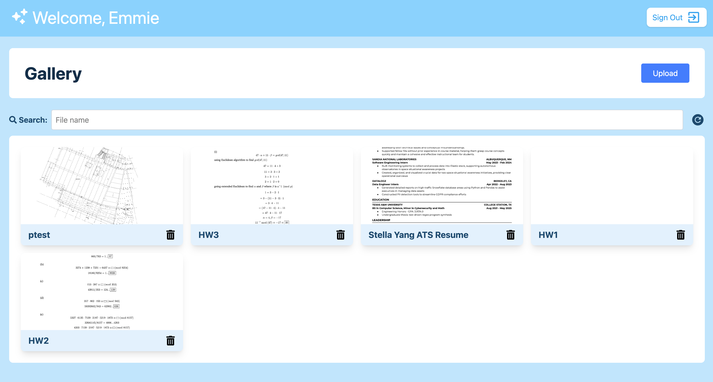

# Emmie Week 10 Individual Report

**Team**: HardHatRacoons (Construction Blueprint)

**Date**:  March 24, 2025

## Current Status

### What did _you_ work on this past week?

| Task                                                          | Status      | Time Spent | 
| ------------------------------------------------------------- | ----------- | ---------- |
| Thumbnail image for the file cards displayed in Gallery       | Completed   |     3      |
| Help with test cases                                          | Completed   |     2      |
| Display all files instead of just annotated                   | Completed   |     2      |
| Revised capstone report                                       | Completed   |    1.5     |

*Include screenshots/diagrams/figures/etc. to illustrate what you did this past week.*

_Figure 1. Thumbnail images for file cards displayed in Gallery_

### What problems did you run into? What is your plan for them?
Testing has a lot of issues where refactoring and adding a new feature would break some of our tests and 
I was unfamiliar with the testing environment. 

### What is the current overall project status from your perspective? 
We are pretty much completing all of the work we are expecting to complete. I think we have all of our core features 
complete and all that's left will be to put our backend algorithm onto our AWS lambda function to connect with our 
frontend. Lastly, we also want to improve our user interface in the frontend to be more user-friendly.

### How is your team functioning from your perspective?
Team functioning great as always! Communication happening daily and everyone feels comfortable asking for help.

### What new ideas did you have or skills did you develop this week?
- Learned how to use the vitest environment to write tests
- Learned more about how to handle pdfs in js

### Who was your most awesome team member this week and why?
Stella for keeping our test coverage up at 100%!

## Plans for Next Week

*What are you going to work on this week?*
- Improving visual front end components
- Implementing other user views (sponsors, admins)
- Planning user studies

