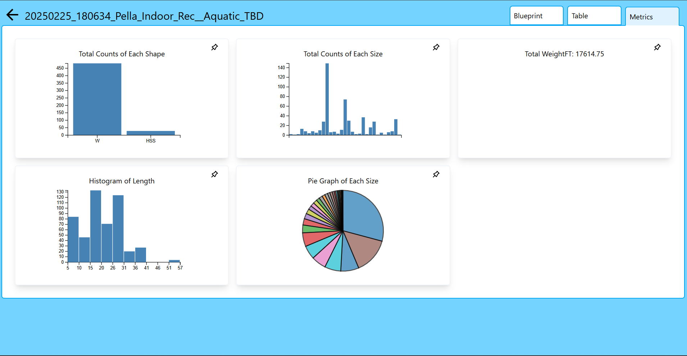

# Lucy Week 10 Individual Report

**Team**: HardHatRacoons (Construction Blueprint)

**Date**:  March 24, 2025

## Current Status

### What did _you_ work on this past week?

| Task                              | Status    | Time Spent | 
| --------------------------------- | --------- | ---------- |
|  making initial graphs   | done | 4 |
|  testing graphs | done (100%) | 1.5 |
|                                   |           |            |

*Include screenshots/diagrams/figures/etc. to illustrate what you did this past week.*

### What problems did you run into? What is your plan for them?
I was having difficulty generating the graphs because the documentation feels sparse. However, I was able to figure it out. Some of the tests were also annoying to write, but I eventually got them done and Stella helped.

### What is the current overall project status from your perspective? 
I think we are on track.

### How is your team functioning from your perspective?
The team is functioning well.

### What new ideas did you have or skills did you develop this week?
I used d3 to generate graphs for the first time! It was pretty cool.

### Who was your most awesome team member this week and why?
My most awesome team member was Stella; she was super busy this week but still helped me a little with testing and set up a large part of the presentations.

## Plans for Next Week

*What are you going to work on this week?*
I will help make the frontend prettier and assist with anything else as needed.
