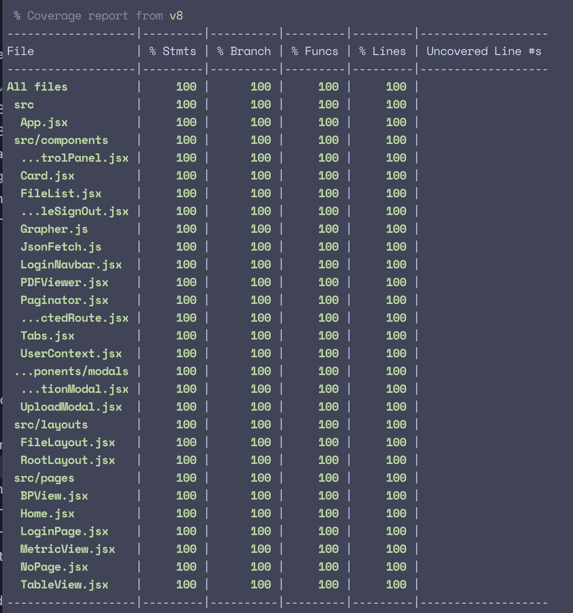

# Stella Week 10 Individual Report

**Team**: HardHatRacoons (Construction Blueprint)

**Date**: March 24, 2025

## Current Status

### What did _you_ work on this past week?

| Task                                                                            | Status    | Time Spent |
| ------------------------------------------------------------------------------- | --------- | ---------- |
| Implement and debug CI where we get automatic comment and block low coverage PR | Completed | 4 hr       |
| Flush out our testing suite to cover small areas that were hard to test for     | Completed | 10 hr      |
| Download button for available annotations and data                              | Completed | 1 hr       |
| Make buttons unavailable if data and annotations were not available             | Completed | 1 hr       |

_Include screenshots/diagrams/figures/etc. to illustrate what you did this past week._

### What problems did you run into? What is your plan for them?
Testing has been an absolute nightmare. I spent an unhealthy amount of time figuring out tests to try to crawl to
unexplored areas of the code base. A lot of things were implemented in the code base in a specific way to satisfy
the APIs that we are calling and a lot of the testing library and the code interacts is very unexpected and they don't provide feedback. 
### What is the current overall project status from your perspective?
I think we are doing good still, but I think we should be working on making new features. Instead of doing more chores. We are already delivering what the sponsor wants, but I think we should start lofi sketching the other views and implement them.
### How is your team functioning from your perspective?
I think we all felt steam running out from the whole team and the team slowed down in progress. But I believe we will pick it back up this week.
### What new ideas did you have or skills did you develop this week?
I learned a lot more about vitest testing and using the mocking library, as well as interacting with async js in testing environment. 
### Who was your most awesome team member this week and why?
Lucy fixed the test that I was struggling on and it's finally working now. 

## Plans for Next Week
_What are you going to work on this week?_
I will be working on implementing the search function on the home page as well as trying to again cover all lines in our test coverage.
