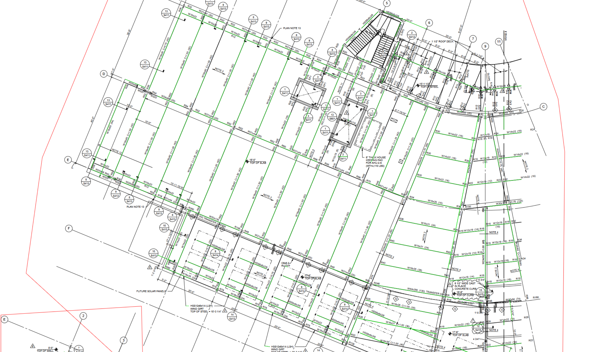

# Chris Week 11 Individual Report

**Team**: HardHatRacoons (Construction Blueprint)

**Date**: March 31, 2025

## Current Status

### What did _you_ work on this past week?

| Task                                | Status      | Time Spent | 
| ----------------------------------- | ----------- | ---------- |
| Identification of individual beams     | In progress | 4 hrs     |
| Capstone Report Evaluation Plan  | Complete | 1 hrs    |
|                                     |             |            |

*Include screenshots/diagrams/figures/etc. to illustrate what you did this past week.*

### What problems did you run into? What is your plan for them?
We are currently working on a temporary solution to replace the sponsor's algorithms as they haven't showed any steps in sharing their algorithm with us, so I attempted to highlight individual beams this week. It is also not standardized, so I am aiming to create a way that pairs each steel beam (ex. "W10X22") with an actual line on the blueprint. However, the words aren't always placed on top of where they should go, and it is sometimes hard to even point out which beam goes where visually. My solution to this is to use nearest beam along with tweaking some values to make sure it ignores any beams that aren't necessary.

### What is the current overall project status from your perspective? 
We are on target to complete the project on time.

### How is your team functioning from your perspective?
We are working well together.

### What new ideas did you have or skills did you develop this week?
Pairing each beam with a line on the page should reduce the number of errors overall.

### Who was your most awesome team member this week and why?
Michael for his work on the lambda function and finding out a way to deal with that.

## Plans for Next Week

*What are you going to work on this week?*

Profiling our code, improving coverage, documentation, and testing.
