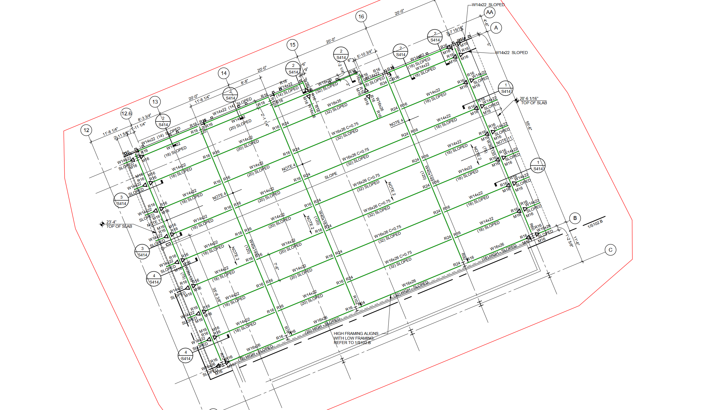

# Chris Week 12 Individual Report

**Team**: HardHatRacoons (Construction Blueprint)

**Date**: April 7, 2025

## Current Status

### What did _you_ work on this past week?

| Task                                | Status      | Time Spent | 
| ----------------------------------- | ----------- | ---------- |
| Identification of individual beams     | Complete | 12 hrs     |

*Include screenshots/diagrams/figures/etc. to illustrate what you did this past week.*

### What problems did you run into? What is your plan for them?
Searching through all matches on the page causes the runtime to increase by a factor of around 3. My plan to fix this is to find a way to reduce runtime by searching through a specific area of the page instead of every part of the page.

### What is the current overall project status from your perspective? 
We are on target to complete the project on time.

### How is your team functioning from your perspective?
We are working well together.

### What new ideas did you have or skills did you develop this week?
Search via box around each line instead of via distance.

### Who was your most awesome team member this week and why?
Michael for his work on integrating front-end and back-end.

## Plans for Next Week

*What are you going to work on this week?*

User studies and reducing runtime if possible
