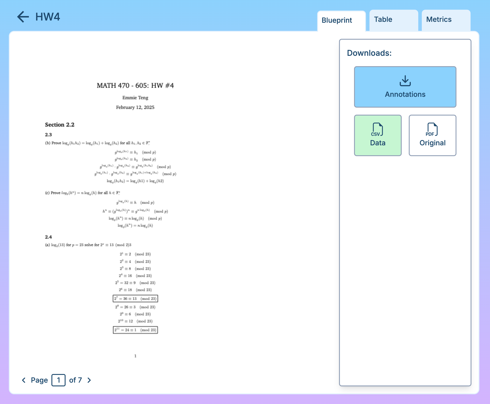
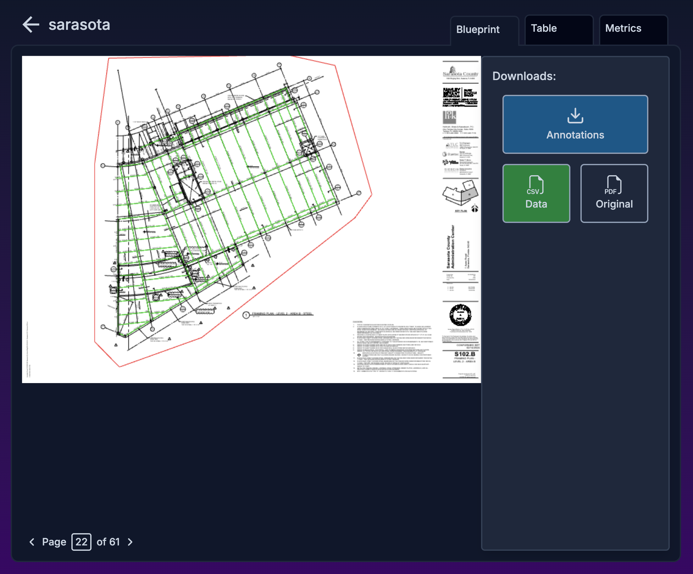
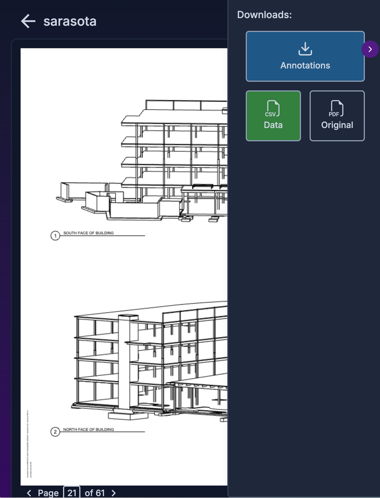

# Emmie Week 12 Individual Report

**Team**: HardHatRacoons (Construction Blueprint)

**Date**: April 7, 2025

## Current Status

### What did _you_ work on this past week?

| Task                                   | Status      | Time Spent |
| -------------------------------------- | ----------- | ---------- |
| Blueprint View improvements            | Completed   | 3          |
| Table View improvements                | Completed   | 1          |
| Metrics View improvements              | Completed   | 1.5        |
| Revise report                          | In Progress | 1          |
| Create User Study survey               | In Progress | 1          |
| Distribute User Study survey           | Not Started | 0          |

_Include screenshots/diagrams/figures/etc. to illustrate what you did this past week._

_Figure 1. New desktop blueprint view in light mode_

_Figure 2. New desktop blueprint view in dark mode_

_Figure 3. New blueprint view on mobile_

### What problems did you run into? What is your plan for them?

We had limited time for working on the project due to hosting other events and upcoming major exams, so we had to cut out some features that we had planned to implement. We looked at the the product backlog and nuked some features that did not add too much to the user experience such as different user views.

### What is the current overall project status from your perspective?

We are done with all our core features and have a nice looking web app that is consistently themed throughout.

### How is your team functioning from your perspective?

Team functioning great as always! Communication happening daily and everyone feels comfortable asking for help.

### What new ideas did you have or skills did you develop this week?

- When to accept that nto everything will be done.
- Sharpened my frontend development skills with giving our site a facelift.

### Who was your most awesome team member this week and why?

Michael for connecting everything together!!

## Plans for Next Week

_What are you going to work on this week?_

- Finish Creating User Study survey
- Distribute User Study survey
- Evaluate product
- Continue revising Capstone Report