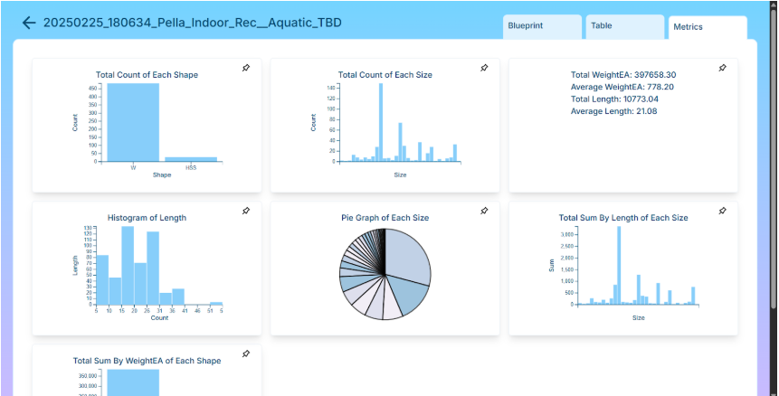

# Lucy Week 12 Individual Report

**Team**: HardHatRacoons (Construction Blueprint)

**Date**:  April 7, 2025

## Current Status

### What did _you_ work on this past week?

| Task                              | Status    | Time Spent | 
| --------------------------------- | --------- | ---------- |
|  adding dark mode   | done | 3 |
|  make graphs look better  |  done  |  3  |
|  worked on capstone report  |  done (finished the part i was working on) |  3  |

*Include screenshots/diagrams/figures/etc. to illustrate what you did this past week.*

### What problems did you run into? What is your plan for them?
I didn't really run into many issues as I was mostly wrapping up things. I did struggle a little bit with adding different graph colors but I figured it out.

### What is the current overall project status from your perspective? 
I think we are on track (almost done!).

### How is your team functioning from your perspective?
The team is functioning well.

### What new ideas did you have or skills did you develop this week?
I got to work more with d3 which was cool. I had some ideas like adding a clear button the search bar which was a simple but nice addition I think.

### Who was your most awesome team member this week and why?
My most awesome team member was Itsara "Danger" Michael McCarthy. He migrated our algorithm from lambda to Elastic Beanstalk API which was nice. 

## Plans for Next Week

*What are you going to work on this week?*
Next week I will focus up on user testing and also normal testing.
