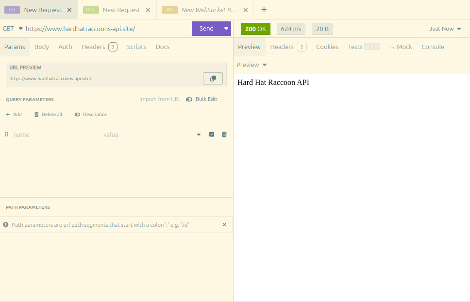

# Michael Week 12 Individual Report

**Team**: HardHatRacoons (Construction Blueprint)

**Date**: April 7, 2025

## Current Status

### What did _you_ work on this past week?

| Task                              | Status    | Time Spent | 
| --------------------------------- | --------- | ---------- |
| Algorithm Coverage to 90% | Complete | 3 Hour |
| Migrate algorithm to Flask API | Complete | 2 Hours |
| AWS Hosting of API | Complete | 3 Hours |
| API integration with frontend | Complete | 2 Hours

*Include screenshots/diagrams/figures/etc. to illustrate what you did this past week.*

### What problems did you run into? What is your plan for them?
Initially I planned to call the API in the backend, but AWS lambda issues strike again. But I found that Amplify's frontend component made the API call possible directly in the frontend.

### What is the current overall project status from your perspective? 
There are a couple small things that could be tweaked or improved, but we are otherwise done.
### How is your team functioning from your perspective?
Team is working well together.

### What new ideas did you have or skills did you develop this week?
I know elastic beanstalk

### Who was your most awesome team member this week and why?
Chris for making a mock version of our Sponsors algorithm.

## Plans for Next Week

*What are you going to work on this week?*
Polishing what we have
