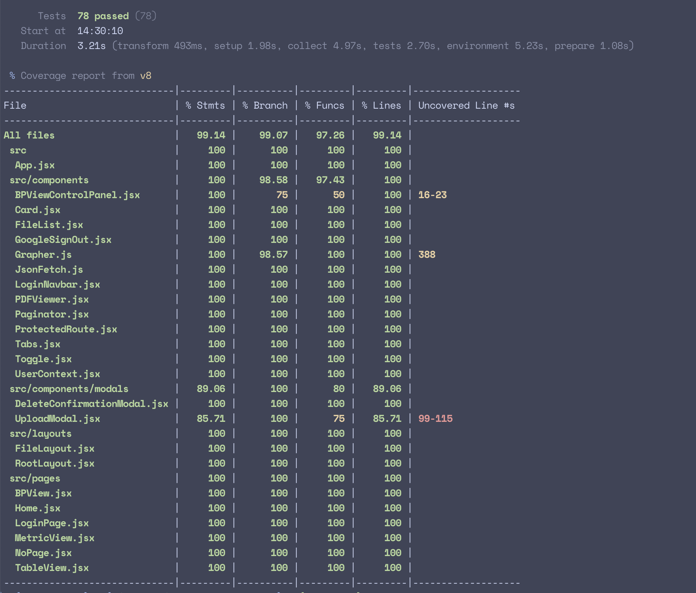

# Stella Week 12 Individual Report

**Team**: HardHatRacoons (Construction Blueprint)

**Date**: April 7, 2025

## Current Status

### What did _you_ work on this past week?

| Task                                    | Status    | Time Spent |
| --------------------------------------- | --------- | ---------- |
| continued updating capstone report      | Completed | 2 hr       |
| Prepared status demo and github release | Completed | 1 hr       |
| wrote tests                             | Completed | 3 hr       |

_Include screenshots/diagrams/figures/etc. to illustrate what you did this past week._

### What problems did you run into? What is your plan for them?

I have been occupied with other things this week to not focus as much on this project.

### What is the current overall project status from your perspective?

I think our progress have slowed down significantly and we are only doing final polishes but we are finished and at a good state to clean.

### How is your team functioning from your perspective?

I think the team is working well. I feel like I would have preferred starting on evaluations earlier but because I have been busy, we haven't gotten to it. We will actually start on it on schedule with the course curriculum.

### What new ideas did you have or skills did you develop this week?

N/A

### Who was your most awesome team member this week and why?

Chris did a really amazing job working on our own algorithm for the demo purposes so that we can actually annotate the steel beams
Michael did a great job finally pulling everything together into one integrated app.

## Plans for Next Week

_What are you going to work on this week?_
I need to move the team towards getting feedback and make actionable tasks out of that feedback.
