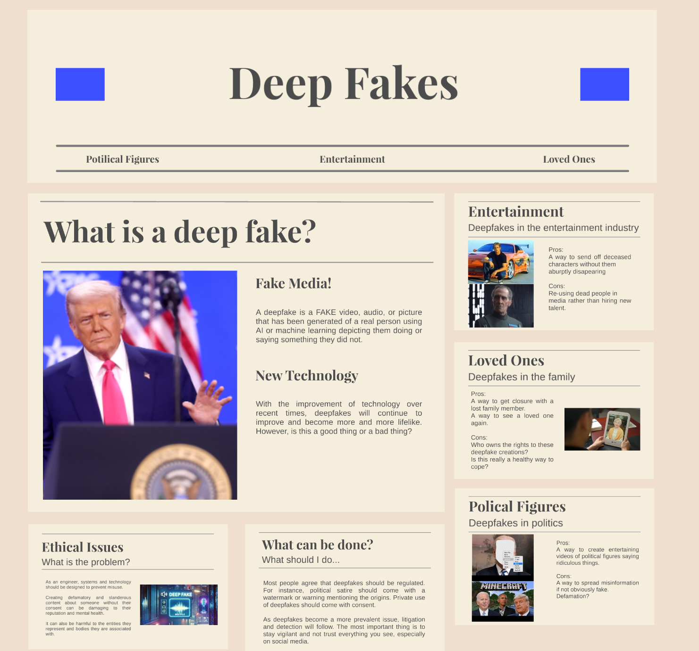

# Chris Week 13 Individual Report

**Team**: HardHatRacoons (Construction Blueprint)

**Date**: April 14, 2025

## Current Status

### What did _you_ work on this past week?

| Task | Status | Time Spent |
| ---- | ------ | ---------- |
| Capstone Poster     |  Complete      |   1 hr         |
| Ethics Synthesis     | Complete       |   1 hr         |
| Reduce Runtime of Algorithm     |  In progress      |   2 hr         |

_Include screenshots/diagrams/figures/etc. to illustrate what you did this past week._

### What problems did you run into? What is your plan for them?
Runtime of algorithm is slow. We aim to improve this by searching in specific areas of each page instead of the whole page.

### What is the current overall project status from your perspective? 
We are on target to complete the project on time.

### How is your team functioning from your perspective?
We are working well together.

### What new ideas did you have or skills did you develop this week?
Search via area of page instead of total page.

### Who was your most awesome team member this week and why?
Michael for his unique ideas and assistance.

## Plans for Next Week

_What are you going to work on this week?_
Reduce runtime of algorithm