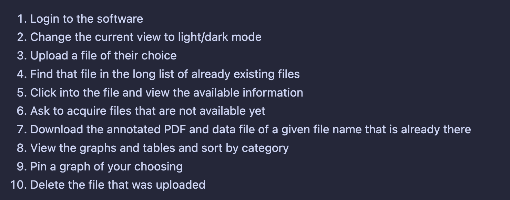

# Stella Week 13 Individual Report

**Team**: HardHatRacoons (Construction Blueprint)

**Date**: April 14, 2025

## Current Status

### What did _you_ work on this past week?

| Task                 | Status      | Time Spent |
| -------------------- | ----------- | ---------- |
| Usability study      | In progress | 4          |
| Meeting with sponsor | complete    | 1          |
| Organize team activity | complete    | 2          |

_Include screenshots/diagrams/figures/etc. to illustrate what you did this past week._

### What problems did you run into? What is your plan for them?

Not really any problems at this stage of the project. We keep coming up with new ideas to evaluate while we are doing it on the fly, and we're trying to update the plan as we go. 

### What is the current overall project status from your perspective?

We are doing really good and the project has been done. There are some things that we never noticed before that we can update on our application.

### How is your team functioning from your perspective?

Really good! We spent a lot of time this Sunday doing activities.

### What new ideas did you have or skills did you develop this week?

I have new ideas of things to implement in our application like:
- sorting our files should be by recent order, or an order that makes sense
- maybe we can automatically open the file that someone uploads

### Who was your most awesome team member this week and why?

Emmie for going out of her way to by hand mass producing stickers efficiently and built a very recognizable brand for our project

## Plans for Next Week

_What are you going to work on this week?_
Finish conducting user studies and create the changes that we learned in the application. 
