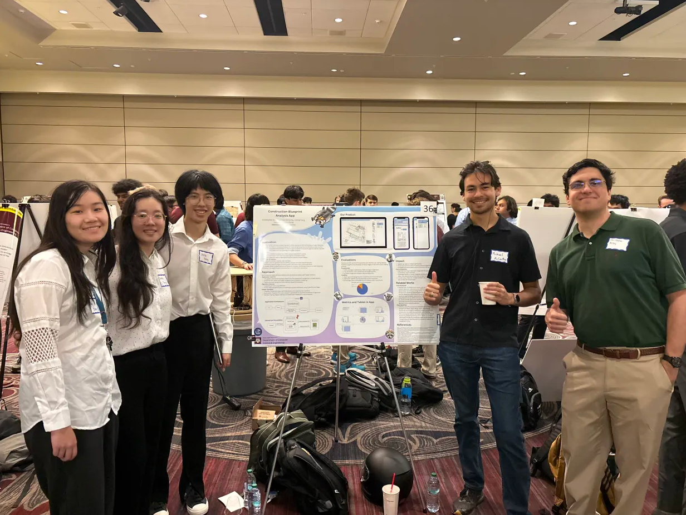

# Emmie Week 14 Individual Report

**Team**: HardHatRacoons (Construction Blueprint)

**Date**: April 21, 2025

## Current Status

### What did _you_ work on this past week?

| Task                              | Status      | Time Spent |
| --------------------------------- | ----------- | ---------- |
| Keep cutting stickers :\(         | In Progress | 1 hr       |
| Continue revising Capstone Report | In Progress | 1 hr       |
| CS Capstone Expo (msc)            | Compelete   | 2 hrs      |

_Include screenshots/diagrams/figures/etc. to illustrate what you did this past week._

_Figure 1. Our team at the CS Capstone Expo in the MSC_

### What problems did you run into? What is your plan for them?
Lots of due dates coming up and I will be out of town soon. I am going to try to knock out as much work as I can before I leave, 
so that my team doesn't have too much on their plate.

### What is the current overall project status from your perspective?
We are making quick hot fixes and tweaks in the frontend according to the results we received from our evaluations

### How is your team functioning from your perspective?
Doing great as always!

### What new ideas did you have or skills did you develop this week?
Sharpened my presentation skills from the Expo.

### Who was your most awesome team member this week and why?
Chris for standing at the poster the whole time during the Expon and reeling in people!

## Plans for Next Week

_What are you going to work on this week?_
- Keep Cutting Stickers
- Continue revising Capstone Report
- Tweaks for front end according to evaluations
