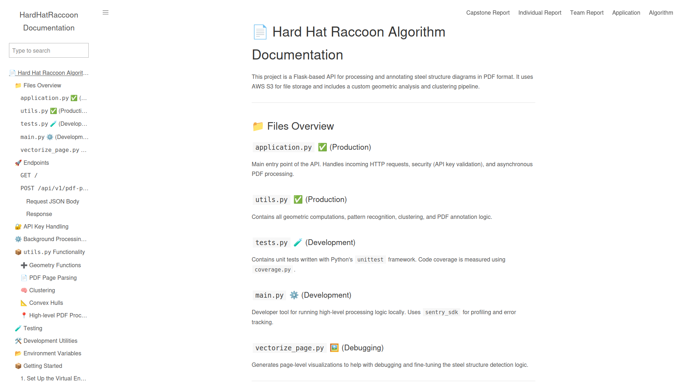

# Michael Week 14 Individual Report

**Team**: HardHatRacoons (Construction Blueprint)

**Date**: April 21, 2025

## Current Status

### What did _you_ work on this past week?

| Task | Status | Time Spent |
| ---- | ------ | ---------- |
| CSCE Expo | Complete | 2 Hours |
| Sent pre-release to sponsor | Complete | 1 Hour|
| Backend comments and documentation | In progress | 1 Hour |

_Include screenshots/diagrams/figures/etc. to illustrate what you did this past week._

### What problems did you run into? What is your plan for them?
Finding things to do during the off week. 

### What is the current overall project status from your perspective?
We are pretty much done with the project. 

### How is your team functioning from your perspective?
Team worked well together

### What new ideas did you have or skills did you develop this week?
I got practice for our poster presentation.

### Who was your most awesome team member this week and why?
Stella for giving me tasks

## Plans for Next Week

_What are you going to work on this week?_
Work on our final presentation