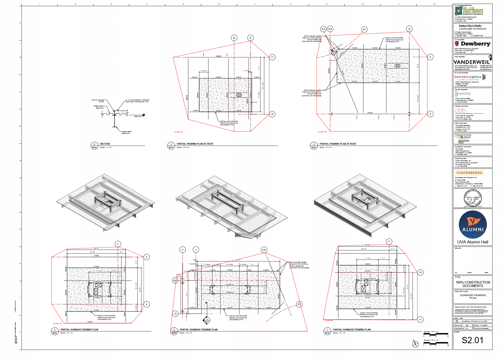

# Chris Week 8 Individual Report

**Team**: HardHatRacoons (Construction Blueprint)

**Date**: March 3, 2025

## Current Status

### What did _you_ work on this past week?

| Task | Status | Time Spent | 
| ---- | ------ | ---------- |
| Identification of important pages     | Complete       |  3 hrs          |
| Identification of important clusters     | Complete       |  2 hrs          |
| Testing for new functions     | Complete       |  30 mins          |

*Include screenshots/diagrams/figures/etc. to illustrate what you did this past week.*

### What problems did you run into? What is your plan for them?

Some problems we ran into include: long run times for clustering algorithm, convex hull algorithm misses some parts of the cluster, and edge cases cause problems for both page and cluster identification. For long run times, we plan on reducing this whenever we are happy with how accurate it is, along with finding out how long our sponsors want it to take. For convex hull missing parts of the clusters, we plan on working towards finding out the cause of the problem over this next week. For edge cases for page and cluster identification, we plan on getting as much specific information as possible regarding which pages the sponsor wants us to find.

### What is the current overall project status from your perspective? 

The current status of the project is on target with how we expected it to be.

### How is your team functioning from your perspective?

Our team is functioning really well together.

### What new ideas did you have or skills did you develop this week?

Learning RegEx for identifying the specific types of steel beams was an important step this week.

### Who was your most awesome team member this week and why?

The most awesome team member was Emmie for her work on the front-end and assistance in authentication.

## Plans for Next Week

*What are you going to work on this week?*
My main goal next week is to work on identifying the edge cases for page and cluster identifications. Also, my goal is to continuously work on deployment, testing, and documentation.