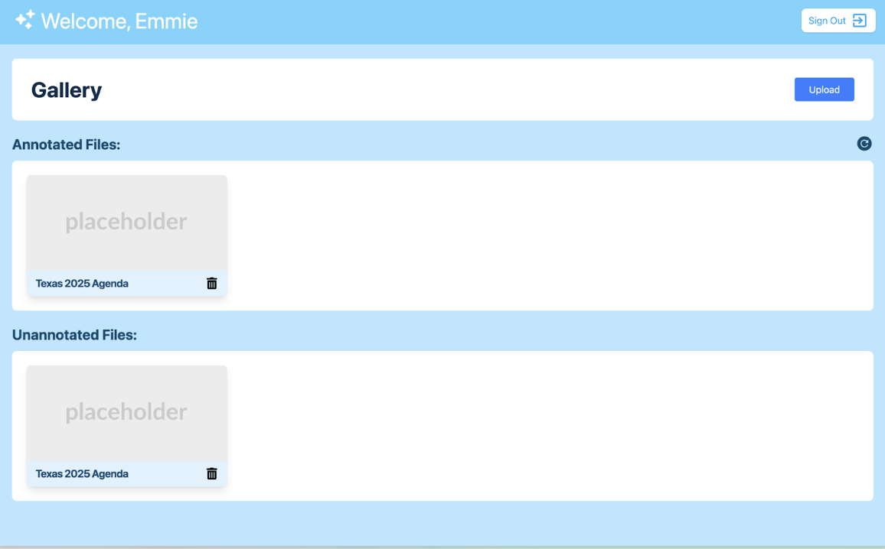

# Emmie Week 8 Individual Report

**Team**: HardHatRacoons (Construction Blueprint)

**Date**:  March 3, 2025

## Current Status

### What did _you_ work on this past week?

| Task                              | Status    | Time Spent | 
| --------------------------------- | --------- | ---------- |
| Display Files on the home page    | Completed |  1.5 hrs   |
| Create cards for files displayed  | Completed |   2 hrs    |
| Help with fixing algo path issue  | Completed |  0.5 hrs   |
| Troubleshooting deployment        | Completed |   2 hrs    | 

*Include screenshots/diagrams/figures/etc. to illustrate what you did this past week.*

### What problems did you run into? What is your plan for them?
Ran into some issues with getting my teammates code to run. It worked on their machine, but not mine.
Ended up troubleshooting together and patching the errors as they popped up, and then we sent our fix
in the discord so that anyone else who comes across the issue will be able to follow along.

### What is the current overall project status from your perspective? 
Current status is great! We finished all of the tasks for our sprint 2 and then some!
Running out of tasks to do, so we will be talking to our sponsor to figure out where to go next.

### How is your team functioning from your perspective?
Team is still doing great as always. No one is afraid of asking for help, and everyone is taking 
responsibility for their respective tasks. 

### What new ideas did you have or skills did you develop this week?
I learned more about implementing file systems as well as deployment quirks on amplify (they store cache and
sometimes new libraries mess things up ugh). Also sharpened my front end design skills :3 

### Who was your most awesome team member this week and why?
Stella is awesome for setting up our routing and fixing everyone's merge conflicts!

## Plans for Next Week

*What are you going to work on this week?*

- Option to delete files from storage on Gallery
- Thumbnail image for the file cards displayed in Gallery
- Document current state of front end
- Convert current capstone report and documents to documentation
