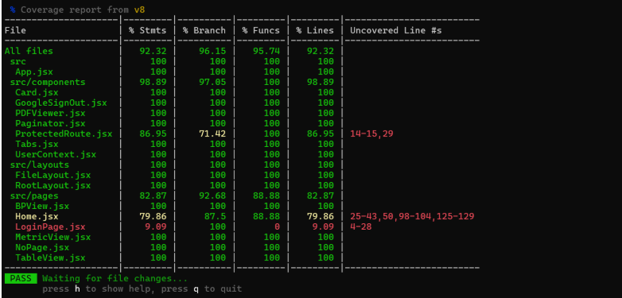
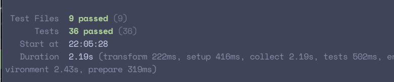

# Lucy Week 8 Individual Report

**Team**: HardHatRacoons (Construction Blueprint)

**Date**:  March 3, 2025

## Current Status

### What did _you_ work on this past week?

| Task | Status | Time Spent | 
| ---- | ------ | ---------- |
| More frontend testing  | In Progress, ~93% coverage overall (was 100% before merge of new features) |     5     |
|      |        |            |
|      |        |            |

*Include screenshots/diagrams/figures/etc. to illustrate what you did this past week.*

### What problems did you run into? What is your plan for them?
I had trouble setting up unhappy tests to run error catching sections. I finally figured out how to do it. I also ran into some issues with mocking that I was able to fix, and authentication too.

### What is the current overall project status from your perspective? 
The project is on track.

### How is your team functioning from your perspective?
The team is functioning well.

### What new ideas did you have or skills did you develop this week?
I developed my vitest/rtl skills further and learned more about mocking.

### Who was your most awesome team member this week and why?
The most awesome team member this week is tied between Emmie and Stella. Emmie made a really pretty file upload and Stella finished authentication/route protecting/routing. Emmie also helped with auth!

## Plans for Next Week

*What are you going to work on this week?*

I am going to work on the on hover annotations and populate the table/metric view if we receive that data.