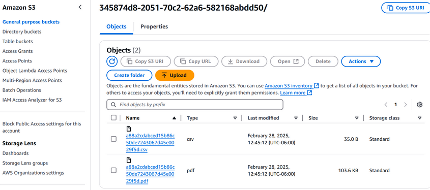
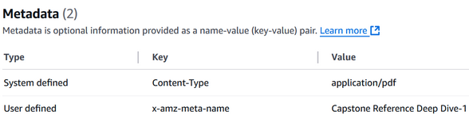

# Michael Week 8 Individual Report

**Team**: HardHatRacoons (Construction Blueprint)

**Date**: 03/03/2025

## Current Status

### What did _you_ work on this past week?

| Task | Status | Time Spent | 
| ---- | ------ | ---------- |
| Lambda wrapper for python function | Complete | 1 Hour |
| Python function to write annotated pdf and csv to bucket | Complete | 2 Hours |
| Pre-processing of pdfs before uploading | Complete | 1/2 Hours |

### What problems did you run into? What is your plan for them?
The documentation for functions in a language aside from JavaScript was terrible/non-existent. I did my best and figured it out.

### What is the current overall project status from your perspective? 
We are finishing up with the “main” features of the product and looking to polish/work on reach goals.

### How is your team functioning from your perspective?
The team is working well together. We each have our strengths that we work toward while still helping each other out.

### What new ideas did you have or skills did you develop this week?
I learned how to write lambda functions with s3 bucket triggers.

### Who was your most awesome team member this week and why?
Emmie did a great job cleaning up the homepage/dashboard.

## Plans for Next Week
Improving accuracy and runtime of clustering algorithms, fixing convex hull algo, add padding to convex hull.