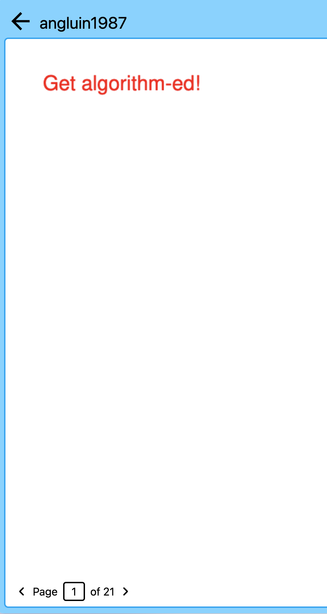
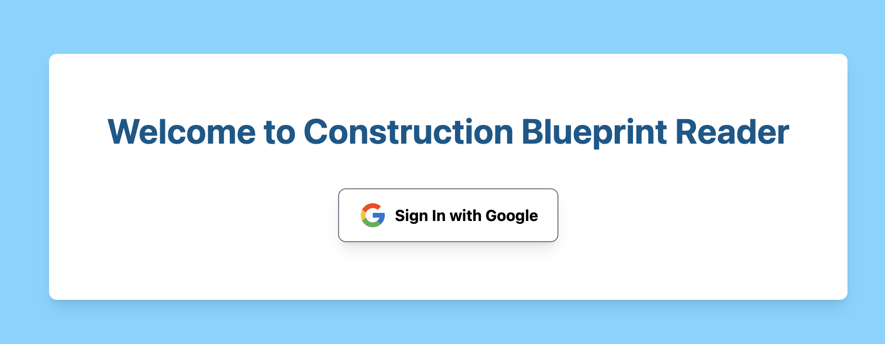

# Stella Week 8 Individual Report

**Team**: HardHatRacoons (Construction Blueprint)

**Date**: March 3, 2025

## Current Status

### What did _you_ work on this past week?

| Task                                    | Status   | Time Spent |
| --------------------------------------- | -------- | ---------- |
| Routing file to specific blueprint view | Complete | 4 hr       |
| Authentication                          | Complete | 3 hr       |
| Reviewing PRs and helping other debug   | Complete | 3 hr       |

### What problems did you run into? What is your plan for them?
I had issues exposing the metadata from our S3 bucket files, but I was able to find relevant information to resolve this issue. For the authentication side of things, there were a lot of things hidden that were not discussed in the documentation was also difficult, but thanks to prior knowledge we were able to figure it out with collaboration with Emmie. I think one of the biggest frustrating factors is that there are very conflicting information throughout version updates.

### What is the current overall project status from your perspective?
I think we are doing very good in project status. I am looking to expand the scope of our project in our discussion with our sponsor tomorrow. 

### How is your team functioning from your perspective?
I think the team is working very well together and its actually depending on a lot of the vision forward from the whole team of where we want to go, as well as small things that individually pop up and we can navigate in an agile-manner that we are getting the product that we want. 

### What new ideas did you have or skills did you develop this week?
I learned more about the authentication workflow and also more about using amplify and AWS. There are a lot of configurations everywhere that can feel to be learned to be more intuitive but not intuitive at first. 

### Who was your most awesome team member this week and why?
Emmie helped around the whole team and have been helpful in getting everyone set up with AWS config things. She also helped me a lot with authentication configs. 

## Plans for Next Week

_What are you going to work on this week?_
I want to work on CI to automatically run prettier and the regression tests that exist to block PRs
