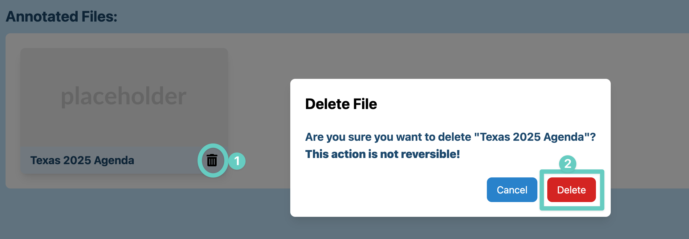

# Emmie Week 9 Individual Report

**Team**: HardHatRacoons (Construction Blueprint)

**Date**:  March 17, 2025

## Current Status

### What did _you_ work on this past week?

| Task                                                          | Status      | Time Spent | 
| ------------------------------------------------------------- | ----------- | ---------- |
| Option to delete files from storage on Gallery                | completed   |    1.5     |
| Thumbnail image for the file cards displayed in Gallery       | not started |     0      |
| Document current state of front end                           | completed   |     2      |
| Convert current capstone report to documentation              | completed   |     2      |
| Troubleshooting teammate's setup                              | completed   |    1.5     |

*Include screenshots/diagrams/figures/etc. to illustrate what you did this past week.*

### What problems did you run into? What is your plan for them?
Motivation to work on capstone during spring break and right before spring break. I will make up for it by 
spending more time on capstone this week. 🫡

### What is the current overall project status from your perspective? 
The team had quite slow progress with the break being in the middle, everyone expected to be doing work over
spring break, but it didn't actually happen.. haha... But its ok! We can work extra hard this week since none
of us have exams!

### How is your team functioning from your perspective?
We chatted over here and there over spring break and kept everyone updated. Team is still doing great 👍

### What new ideas did you have or skills did you develop this week?
- Figured out how to make nice markdown tables ;w;
- Learned how to set up our environment on windows

### Who was your most awesome team member this week and why?
Stella for being the sole soldier working at 2am over spring break.

## Plans for Next Week

*What are you going to work on this week?*

- Option to delete files from storage on Gallery
- Thumbnail image for the file cards displayed in Gallery
- Document current state of front end
- Convert current capstone report and documents to documentation
