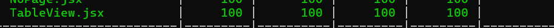
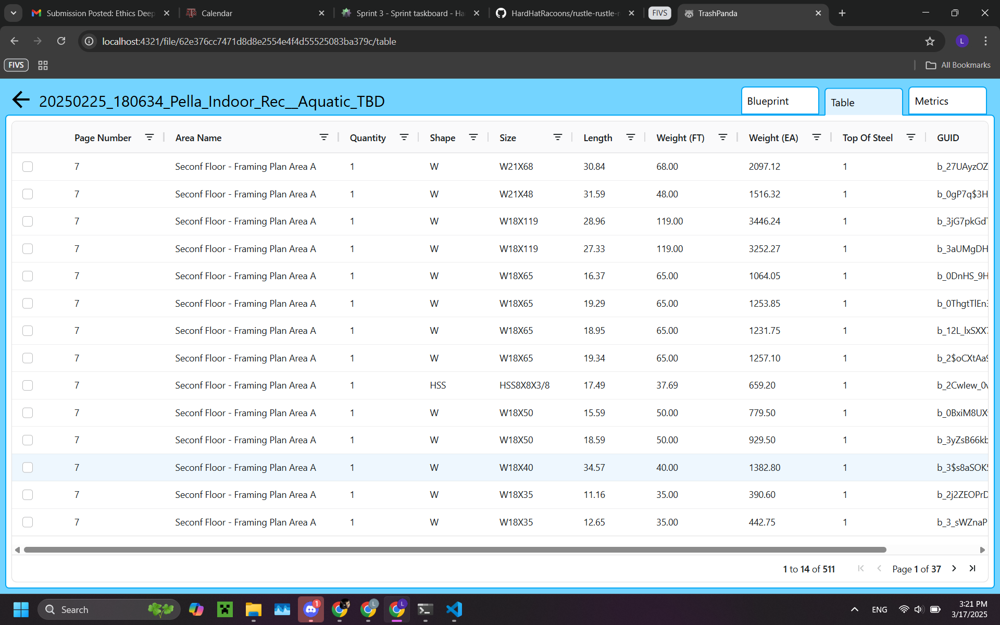

# Lucy Week 9 Individual Report

**Team**: HardHatRacoons (Construction Blueprint)

**Date**:  March 17, 2025

## Current Status

### What did _you_ work on this past week?

| Task                              | Status    | Time Spent | 
| --------------------------------- | --------- | ---------- |
|  Putting csv data into table view   | done | 2 |
|  testing table view | done (100%) | 2 |
|                                   |           |            |

*Include screenshots/diagrams/figures/etc. to illustrate what you did this past week.*

### What problems did you run into? What is your plan for them?
My environment wasn't working properly and we found out after intensive debugging it was due to me installing the windows version of aws sandbox instead of the linux version.

### What is the current overall project status from your perspective? 
I think we are on track.

### How is your team functioning from your perspective?
The team is functioning well.

### What new ideas did you have or skills did you develop this week?
I used aggrid and worked on my csv/json processing skills.

### Who was your most awesome team member this week and why?
My most awesome team members were Stella and Emmie, because they helped me debug my environment.

## Plans for Next Week

*What are you going to work on this week?*
I am going to add graphs and test them.
