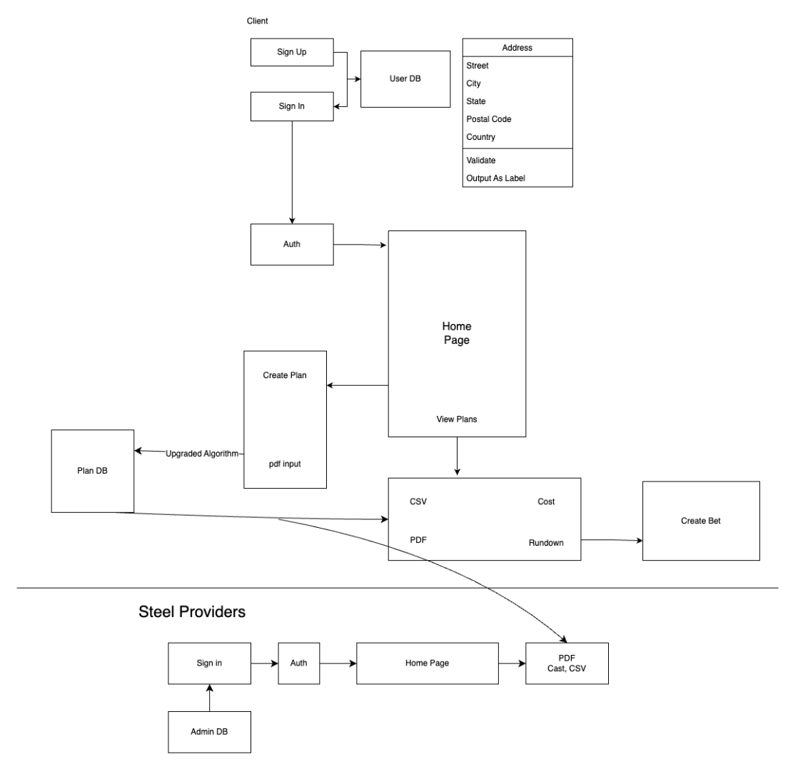
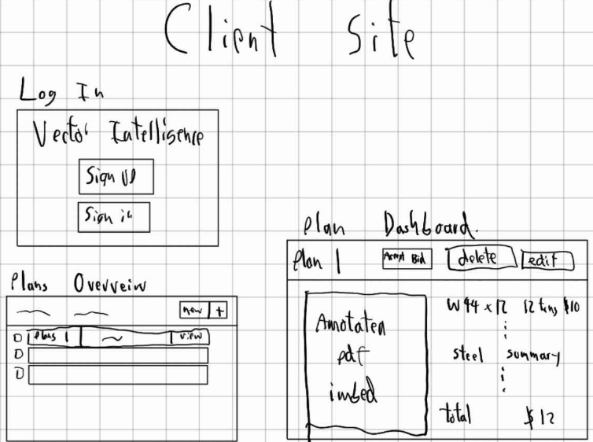
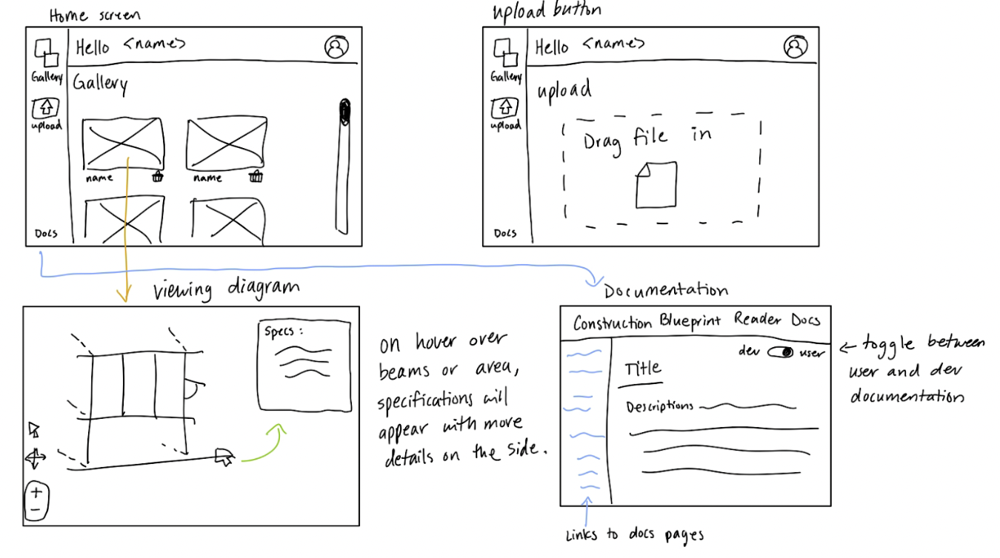
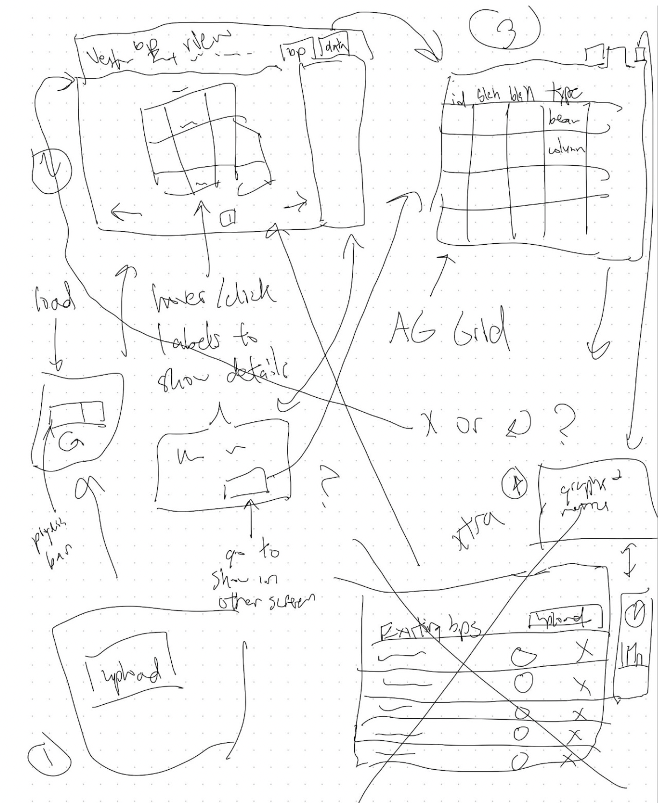
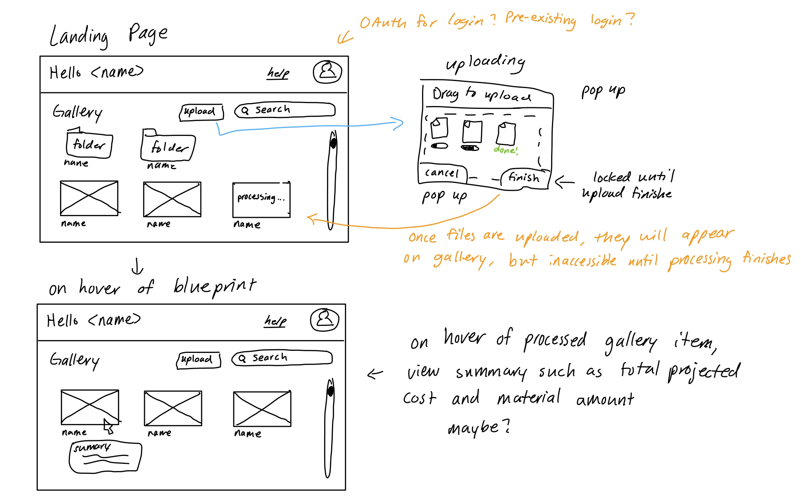
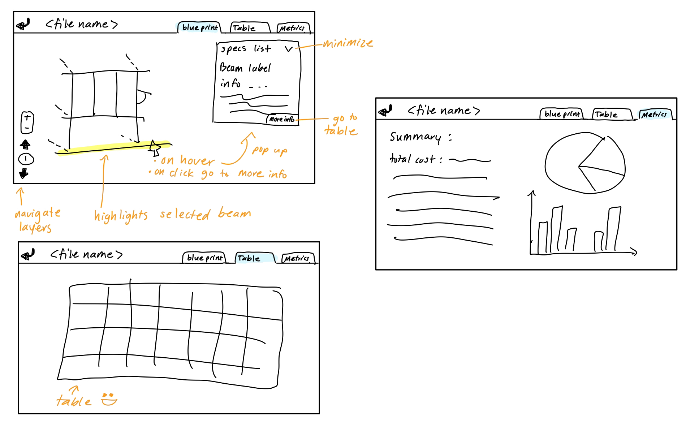
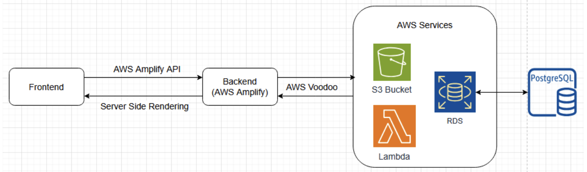
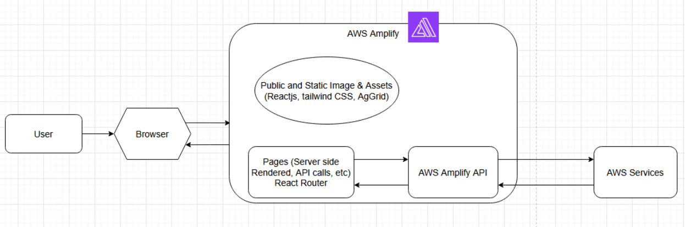
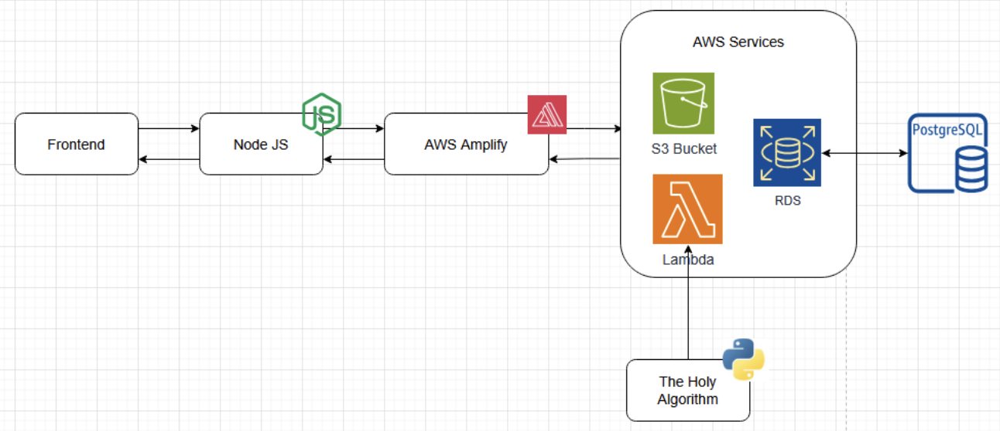
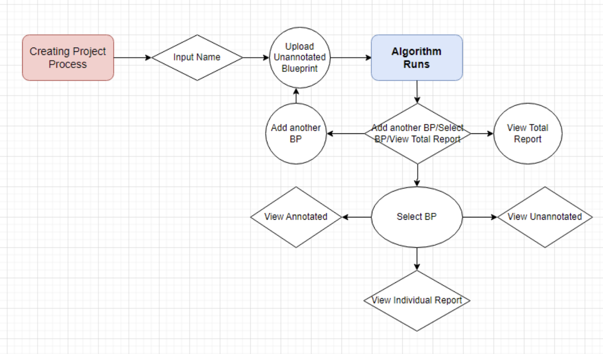

# Capstone Report - HardHatRacoons
Devs: Chris Kelley, Michael McCarthy, Emmie Teng, Stella Yang, Lucy Zhang

## Introduction
The construction industry accounted for over 8 million jobs in 2024, according to the US Bureau of Labor Statistics (1). Vector Intelligence is partnered with the steel industry to create a software that helps the end users estimate their projected material cost from a vectorized construction blueprint. This allows for end users to spend only a few minutes to gain specifications and insights about a project instead of spending days to get the same information manually. The initial success rate of the software in automatically generating specifications from a construction blueprint is 75% and our job will be to enhance that algorithm while wrapping all of the information into a more user friendly interface.

### 1.1 Case Scenarios

#### Construction Supply
John owns a construction supply company that provides steel beams, concrete, and other materials. He frequently receives bulk orders from contractors and engineers but struggles to predict material demand accurately.
One day, a contractor using the Blueprint Analysis System reaches out with an automated material list generated from a newly analyzed blueprint. The system provides detailed insights, including:

- Exact quantities of beams, columns, and concrete needed
- Projected delivery timeline based on project phases
- Material specifications ensuring compatibility with the project

Using this data, John updates his inventory and places early supplier orders to meet demand. Additionally, the system suggests other upcoming projects in the area with similar material needs, helping him forecast future sales.
By leveraging real-time blueprint analysis, John minimizes stock shortages, reduces excess inventory costs, and ensures timely deliveries, leading to stronger relationships with contractors.

#### Construction Team
Sarah is reviewing a new architectural blueprint for a high-rise building. Traditionally, she would manually label beams, columns, and estimate material quantities—a tedious and error-prone task.
She uploads the blueprint into the Blueprint Analysis System, which:

- Automatically detects and labels all beams and columns
- Calculates material requirements, including steel reinforcement and concrete volumes
- Highlights potential errors, such as missing load-bearing columns

The system generates a PDF report with annotations and a bill of materials, allowing Sarah to quickly validate the data and share it with the construction team.

By automating blueprint analysis, Sarah saves hours of manual work, reduces the risk of structural miscalculations, and ensures a smoother transition from design to construction.

### 1.2 Goals and Constraints
The team will create a UI/UX web app that asks for user input of a construction blueprint pdf file in vector format and returns a file or view with all the steel beams and columns highlighted, marked, and labelled to scale. The team is expected to read through existing code and refine it, as well as add features like labelling concurrent columns and discerning overlapping sections. The UI/UX will also display information about the beams separately and may display a few analytics as a reach goal. The web app should be accessible, aesthetic, and easy to use. The team may leverage machine learning to achieve these goals. 

The team is not expected to create a 3D model of the construction blueprint file at the given time. The team is also not expected to make any improvements to the Vector Intelligence portal website.

### 1.3 Solution Summary

The end goal of our project is to quickly and efficiently automate the task of determining which materials will be used in construction. The purpose of this is to allow the end users to get an estimate for how much a construction project will cost them. Our solution will work by assigning materials to every line and symbol in a blueprint which will later be used to account for that material in the total weight of the building. Specifically, we will create an algorithm that can automatically label every beam needed along with its dimensions and weight. We will then store this data using vector format and mark any materials that are already accounted for.

## 1.4 Evaluation Summary
The system will be evaluated through a combination of quantitative and qualitative approaches:

**Quantitative:** The system will be evaluated based on the success rate of the program compared to the initial starting point (the aim will be increasing the success rate from 75% -> 90%). This will involve comparing the specifications generated from our improved algorithm to the original set of results.

**Qualitative**: We will utilize surveys and interviews for end users to gauge the accessibility and user friendliness of our front end designs. These will focus on areas such as ease of navigation, visual design, and the intuitiveness of interactive elements.

**Main findings**: this section will be filled out as we proceed with our evaluations.

## 2 Related Work
TBD

## 3 Requirements
The requirements section focuses on user stories and identifying a success criteria. The user stories go over the need for an accessible, user-friendly interface for various stakeholders. The success criteria involve improving the blueprint reading algorithm and creating the user interface to present the results.

### 3.1 User Stories and Usage Scenarios
1. As a *construction company*, I want to save the two hours it takes to manually parse a construction blueprint pdf to create a bid. Parsing the blueprint to find the sizes and amounts of steel needed for construction is a tedious and time-consuming process. 
2. As a *client*, I want a crisp user interface to view the resulting data from scanning the construction pdf. The client UI should present the (modified) annotated PDF with clearly demarcated beams and columns. The project aims to automate this process, annotating the submitted PDF and producing an accurate report of the client’s steel needs.
3. As a *vision impaired user*, I want the UI to be accessible for me. The UI should have the ability to increase and decrease the size of text universally and have high contrast. Images should have alt text and the web app should ensure screen reader compatibility. This will allow me to adjust the UI to be more readable for me or play the page to get the information I need.
4. As a *dyslexic user*, I want to be able to view the information in a font that is more readable for me. The UI should provide basic font switching features. This ensures that I can read and understand the information being presented better.
5. As a *user without a home computer*, I want to still be able to use this software at home. The UI should be mobile friendly and implement dynamic resizing/relayouting based on view size so that it can fit on a variety of different devices. This will allow the software to be used from different devices and viewport sizes including tablets, phones, and splitscreen.
6. As a *user who prefers certain web browsers*, I would like to be able to run the web app on my preferred web browser of choice. The project should be compatible with the major web browsers such as chrome, firefox, and edge. This will allow users with different system requirements or preferences to use their preferred browser.
7. As a *hearing impaired user*, I would like the app to be accessible for me. All sounds and videos must have a text or visual equivalent representation. This includes shaking for notifications, subtitles, etc, as necessary. This will ensure that all the information needed is presented to all users in a way they can pick up on.
8. As *someone who has to work late nights*, I want the UI to not be too glaring. The UI should have the ability to switch between light and dark modes. This will allow me to switch to a more comfortable mode later in the day when visibility is lower.
9. As a *structural engineer*, I want to be able to see the annotated construction blueprint with all the data displayed but not visually cluttered so I can understand it. The UI should have multiple toggleable settings that show different information about the blueprint and allow the blueprint to be zoomable. This will allow clients who need specific information about the blueprint to toggle settings on and off as needed and zoom in to problem areas.
10. As a *construction estimator*, I want to be able to easily see summarizing information about the project to refine my bid creation experience. The UI should provide data analytics in a different tab that can assist with bid estimation. This will allow construction estimators to save time when creating bids for projects.
11. As a *steel supplier*, I want to know what types of steel are currently being used the most in my client’s construction projects. The project should provide collated metrics for steel suppliers based on client inputted blueprints. This will allow steel suppliers to stock types of steel that the clients might need soon and provide other ways to ensure they are not caught unaware. 
12. As a *steel supplier*, I want a single place to view all the steel needs for a single bid, so that I do not have to go hunting/piecing together where to deliver/supply the steel.
13. As a *construction manager*, I want the user interface to be intuitive to use so that there does not need to be a lot of training for my employees.
14. As a *structural engineer*, I want the system to automatically extract and label beams and columns in a blueprint, so that I can quickly assess structural components without manual inspection.
15. As a *structural engineer*, I want the system to calculate the amount of materials needed based on the blueprint, so that I can make accurate material purchase decisions.
16. As a *structural engineer*, I want the system to annotate my PDF blueprints with labeled beams, columns, and material specifications, so that I can share them with my team efficiently.
17. As a *structural engineer*, I would like to scan the blueprints with my phone so that I can easily manage and view multiple blueprints in any session
18. As a *contractor*, I want the system to generate a detailed material list from the blueprint, so that I can accurately order supplies without wasting resources.
19. As a *project manager*, I want a dashboard that summarizes extracted data from blueprints, so that I can make informed decisions without manually reviewing each document.
20. As a *project manager*, I want the system to facilitate blueprint approvals with engineers and architects, so that I can streamline project workflows.

### 3.2 Definition of Success
The process for reading blueprint information has already been completed with a 75% success rate, and our task will be to increase the success rate to 90% through improving their current algorithms and potentially introducing machine learning. The current construction blueprint reader algorithm only works on a specific type of blueprint, and the sponsors would also like to be able to support more types of blueprint formats which is more of a stretch goal. By the end of this project, we aim to have a functional user interface that is simple to navigate and understand for the users. The user interface should have an intuitive way of representing specifications of all the different beams, either horizontal or vertical, within the scanned blueprints. The interface should also make sense to a user who is not familiar with construction. Analysis for success of the User interface will be evaluated through survey results of targeted end users. Lastly, the product should be able to analyze the blueprint to give a list of material specifications as well as the projected project cost within 90% accuracy. 

## 4 Engineering Standards, Regulations, and Considerations
TBD

## 5 Design Exploration
### 5.1 Comparison of Potential Solutions
Since our main goal is to reduce the amount of time spent during construction on determining the total cost of the whole construction project, there are a few different ways to do this. Method 1 is to take blueprint pdfs, run them through an algorithm that determines the weight and cost of each piece, and total up the cost. Method 2 is to use a formula to roughly estimate the total cost based on the volume and surface area of each floor. Method 3 is to look at historical data and find buildings of the same size and shape and estimate the value based on that data. All 3 of these methods will give us estimates that might be close to the exact value, but one method makes the most sense. Since one of our end goals is to reach a minimum success rate of 90%, we want to be very precise in calculating this total cost. Method 2 and 3 have the problem of being rough estimates, meaning they aren’t precise enough. Method 1 is more difficult, but if done correctly, it should lead to accurate results. Without looking specifically at the blueprint and calculating the cost of each piece, we won’t achieve results with the desired level of accuracy. Because of this, we will be choosing method 1 going forward. 

### 5.2 Lo-fi Prototyping

*Figure 5.2.1 Initial System Diagram*

*Figure 5.2.2 Client UI Lo-fi Mockup - Idea 1*

*Figure 5.2.3 Client UI Lo-fi Mockup - Idea 2*

*Figure 5.2.4 Client UI Lo-fi Mockup - Draft*

The above Lo-Fi mockup in Figure 5.2.4 has multiple ideas in a rough sketch. Each part could be an individual feature. Figure 5.2.2 and 5.2.3 are more flushed out Lo-Fi designs that can be combined in the future.

### 5.3 Pilot Studies
Feedback received from our pilot studies concludes that our Lofi-Designs is definitely an improvement to the current existing interface, and there are also many suggestions for further improving our designs. Some of the notable comments were:
- Adding search bars / filters to screens for finding projects and building materials
- Clear icons and symbols to tell users where they are
- Hover over a project to summarize important information such as total cost
- Project folders of blueprints to organize gallery view
- Multi-pages/floors should be able to be navigated within the same file 
- Regoranize upload button and loading to streamline the process

*Figure 5.3.1 Redesigned Lo-Fi of home-page and loading screen*

*Figure 5.3.2 Redesigned Lo-Fi of blueprint viewing and metrics pages*

### 5.4 Inclusion, Diversity, Equity, and Accessibility Considerations
This increases the accessibility of construction blueprints by allowing anyone to quickly read and understand the specifications of a building. It will also be helpful to the construction workers who are in charge of the actual construction by allowing them to visually see what their final work should look like. The software should be designed in a way where the outputs can be understood by not only professionals but also the common construction worker. 

The UI/UX should meet a minimum accessibility requirement, accommodating those with various disabilities (such as motor or vision impairments) to use the product. The annotated PDF should be modified in a way such that it does not interfere with the existing accessibility options of the original document (PDF audio reader and existing text/images should not be impaired by the annotation).

## 6 System Design
### 6.1 Functional Design

*Figure 6.1.1 Level 0 Diagram*

*Figure 6.1.2 Level 1 Frontend Diagram*

*Figure 6.1.3 Level 1 Backend Diagram*

*Figure 6.1.4 State Diagram* 

#### Module Specifications:
**ReactJS** - Using ReactJS as our frontend framework to build components and the UI used by our website.
**Tailwind** - Tailwind is the primary CSS library used to style our HTML.
**AgGrid** - Used to generate/prototype grid layouts used by the website
**React Router** - Used to route multiple react pages.
**NodeJS** - Used to import npm packages used by the project such as React Router and AWS Amplify
**AWS Amplify** - Used to host the front end as well as communicate with the various AWS services.
**AWS S3** - Storage bucket used to store PDFs and CSVs.
**AWS Lambda** - Used to automatically run the magical Python algorithm when Blueprint is pushed to the S3 bucket.
**AWS RDS** - Used to host the PostgreSQL database
**PostgreSQL** - PostgreSQL is the primary database we will use to store information about blueprints, projects, and users.
**GitHub** - Used to collaborate and set up GitHub Actions to push code to Amplify

#### API Specifications:
AWS API (Amplify), used to communicate with auth, S3, Lambda, and SQL databases, as well as host/deploy the website.

### 6.2 Data Design

*Figure 6.2.1 UML Diagram*

Our data will be stored using S3 Buckets and PostgreSQL in AWS. There are a few major data structures that need to be stored including users, projects, blueprints, CSVs, and components. Following our user stories, a user can create a project or edit a project. Also, a user can add a blueprint or multiple blueprints to a project. After adding a blueprint to a project, the algorithm will run, automatically creating a CSV related to that blueprint and the necessary components that make up the blueprint. 

## 7 Evaluation
TBD

## 8 Discussion
TBD

## 9 Future Work
TBD

## 10 Conclusion
TBD

## References
(1) U.S. Bureau of Labor Statistics. (2025, January 2). Industries at a glance: Construction: NAICS 23. U.S. Bureau of Labor Statistics. https://www.bls.gov/iag/tgs/iag23.htm

## Appendix A: Project Management
### A.1 Team Agreement
#### Team Goals and Objectives
- Improve Blueprint Reading Algorithm
- Develop 3D modelling script
- Have fun working on the project!

#### Roles and Responsibilities
**Project Lead:** Stella Yang
- Communication with customer
- Coming up with stories

**Frontend Lead:** Lucy Zhang 
- Design and Implementation of Frontend
- Document Frontend

**Backend Lead:** Michael McCarthy
- Drafting and Implementation of Algorithms
- Document Bugs and Backend

**CI/CD Lead:** Christopher Kelley
- Continuous integration/continuous deployment
- Automatic testing for new changes
- Ensuring the latest version is deployed

**SCRUM Master:** Emmie Teng
- Organizing team meetings and keeping meeting notes
- Assigning tasks to team members
- Other logistics

#### Communication Expectations
- Communicate changes if there are updates since the last discussion
  - Wait for some approval from team if not urgent
- Discord Bot to communicate GitHub changes
- Discord as primary line of communication
  - Check daily and keep notifications on
- Ping @everyone if its urgent
- For shared responsibilities, new tasks (not programming) can be posted in a discord channel and can be claimed
  - This can be updated to an alternate system if it proves to not work
- Start trying early and ask for help early

#### Meeting Structure and Availability Expectations
- Meetings with sponsors
  - Report on progress completed done in the past week (from our scrum board)
  - Questions for sponsors
  - Check if we are expecting the same thing as our sponsors
  - Note down general topics of meeting
  - Put down questions/notes/concerns for sponsors throughout the week
- Show up to every class and let team know ahead of time if there is a conflict

#### Change Requests
- Don’t push to main
- Branch protection
- Branch naming should be in the format of <feature/bug>/#-name-name
- Make small and frequent commits
- Make small PRs
- Critical Bugs fixed ASAP

#### Team Agreement Maintenance
- Once a month, come back to this document and update any needed changes

#### Team Member Signatures
- Itsara McCarthy
- Lucy Zhang
- Stella Yang
- Emmie Teng
- Chris Kelley

### A.2 Software Development Methodology
Currently, at this stage of our planning, the waterfall methodology seems to be the best fit for our project. The sponsors already have a clear vision for the project and list of requested features, as the students will be building upon an existing codebase. If the sponsors plan to add requirements as the project progresses, the team may consider agile development to be a better fit; the frontend can possibly utilize the agile methodology for implementing small minimally viable features depending on the feedback from the sponsors.

According to the sponsors, the team will be split between frontend and backend. The backend team will focus on enhancing the current blueprint vector reading algorithm through implementing features such as steel column recognition and giving users data that helps with cost analysis. The frontend team will work on creating a user friendly visualization of the data gathered by the backend team. The completed code will be deployed on Amazon Web Services.

### A.3 Implementation Schedule
Here's a structured implementation schedule for your CAPSTONE project using 2-week sprints under Agile methodology. The schedule ensures continuous integration, demo readiness, and incremental feature development.

#### Sprint 1 (Weeks 1-2) – Project Setup & Basic Upload Functionality**
- Ensures team alignment with CI/CD setup.
- Establishes basic inventory system foundation.
- Enables early integration between frontend and backend.

**Must-Haves:**
- Set up project repository and CI/CD pipeline.
- Create initial frontend layout with user authentication.
- Implement PDF upload functionality in the frontend.
- Develop backend API for storing and retrieving PDF metadata.

**Like-to-Haves:**
- Implement UI feedback (upload progress, success/failure notifications).
- Begin designing database schema for managing PDFs and labeled pages.

#### Sprint 2 (Weeks 3-4) – PDF Management & Steel Labeling Prototype
- Users can now view and manage uploaded blueprints.
- Laying the groundwork for automatic steel detection in blueprints.
- Early feedback cycle on extraction and classification logic.

**Must-Haves:**
- Implement PDF retrieval and listing in frontend (users can see uploaded files).
- Store PDFs in a database with metadata (e.g., name, size, upload date).
- Develop backend logic to extract text from PDF (foundation for steel detection).
- Create an initial prototype of steel detection (e.g., identifying keywords).

**Like-to-Haves:**
- Implement user roles (admin vs. standard users).
- Allow basic PDF categorization/tags for organization.

#### Sprint 3 (Weeks 5-6) – Enhanced Labeling & User Interaction
- Brings intelligence into the system for automatic labeling.
- Allows for user intervention to improve accuracy.
- Enhances user experience with better filtering and page navigation.

**Must-Haves:**
- Improve steel labeling accuracy with better parsing techniques.
- Display labeled pages in frontend with basic UI elements.
- Add UI interaction: users can manually adjust or confirm labels.

**Like-to-Haves:**
- Implement filtering options for blueprints by category.
- Add support for multiple PDF pages in the frontend.

#### Sprint 4 (Weeks 7-8) – Final Features & Optimization
- Ensures the final product is performant and user-friendly.
- Prepares for final demo and delivery.
- Extra features improve usability but are not critical for core functionality.

**Must-Haves:**
- Optimize backend for faster PDF processing.
- Improve UI for better user experience (pagination, sorting, search).
- Final bug fixes and testing.
- Conduct final demo and prepare documentation.

**Like-to-Haves:**
- Implement analytics (e.g., track most accessed blueprints).
- Add export functionality (download reports of labeled blueprints).

### A.4 Software Development Artifacts
#### Product Backlog:
**Sprint 1**

|  Id  | User Story                                                | Assigned to         | Points    |
| ---- | --------------------------------------------------------- |-------------------- | --------- |
|  1   | Identifying pages related to steel                        | Michael             |     1     |
|  2   | Identifying clusters related to steel and annotate them   | Michael, Chris      |     5     | 
|  3   | Basic navigation and set up of web app                    | Lucy                |     1     |
|  6   | Fine Tuning DBSCAN for better identification              | Michael, Chris      |     5     |
|  7   | Deploy project on AWS Amplify                             | Chris               |     3     | 
|  9   | View Annotated PDF on web app                             | Lucy                |     3     |

**Sprint 2**

|  Id  | User Story                                                           | Assigned to         | Points  |
| ---- | -------------------------------------------------------------------- |-------------------- | ------- |
|  8   | Displaying a list of blueprints that a user has                      | Emmie               |    3    |
|  22  | Upload interface with file upload to AWS                             | Emmie               |    2    | 
|  37  | Select a blueprint to view from file view                            | Stella              |    1    |
|  42  | Run Annotation algorithm on AWS lambda                               | Michael             |    5    | 
|  43  | Blueprint identification of important pages to actually annotate     | Chris               |    5    | 
|  44  | dentification of important clusters to annotate on given page in PDF | Chris               |    2    |
|  59  | Design and implement table view                                      | Lucy                |    3    | 
|  60  | Design and implement metrics view                                    | Lucy                |    3    | 
|  62  | Authentication                                                       | Stella              |    2    |

**Sprint 3**

|  Id  | User Story                                                           | Assigned to         | Points  |
| ---- | -------------------------------------------------------------------- |-------------------- | ------- |
|  54  | Display title in a gallery for blueprint files                       | Emmie               |    2    | 
|  95  | Delete file button                                                   | Emmie               |    1    | 
|  86  | Display thumbnail on blueprint files                                 | Emmie               |    3    |
|  99  | Profile and analyze clustering performance                           | Chris & Michael     |    2    | 
| 100  | Reduce clustering algorithmn run time                                | Michael             |    5    |
| 101  | Identify edge cases for page identification                          | Chris               |    2    | 
| 102  | Identify edge cases for clustering identification                    | Chris               |    5    | 
| 103  | Padding the convex hull identification                               | Michael             |    1    | 
| 104  | Populate tables with CSV                                             | Lucy                |    1    | 
| 105  | Button to download PDFs                                              | Stella              |    1    | 
| 106  | Status display of completion of annotation                           | Stella              |    1    | 
| 111  | Search bar by name feature for blueprint file                        | Stella              |    2    |
| 117  | Initialize metric view graphs                                        | Lucy                |    2    | 
| 118  | Error message for file you don't own                                 | Lucy                |    1    | 
| 122  | Develop test bed of potential input for algorithm                    | Michael             |    3    |

**Sprint 4**
|  Id  | User Story                                                           | Assigned to         | Points  |
| ---- | -------------------------------------------------------------------- |-------------------- | ------- |
| 112  | Hover over blueprint to get summarized data                          | Emmie               |    2    | 
| 116  | Integrate algorithm to run with the app                              | Michael             |    3    | 
| 119  | File sharing between users                                           | Emmie               |    3    | 
| 121  | Steel provider provisioning users                                    | ??                  |    ?    |        

### A.5 Budget
As of the current phase of the project we project that we will only need a budget to pay for AWS Cloud Computing services. The specific services that we will be using are:

- **S3 Bucket** - cloud file storage and hosting of website
- **EC2** - API server for backend
- **Lambda Function** - running the algorithm for converting pdf to csv files of data
- **Pipeline** - CI/CD

This may change in the future as we discover more requirements or when we move to more advanced stages of the project.
